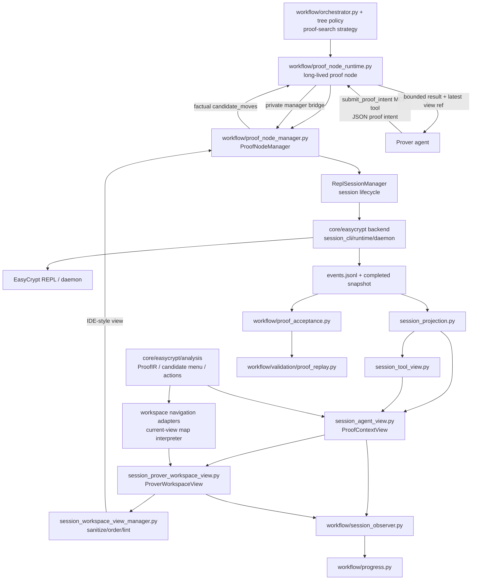

# Shannon Prover

**LLM agents that write machine-checked cryptographic proofs.**

Shannon Prover connects language-model agents to the
[EasyCrypt](https://www.easycrypt.info) proof assistant through managed proof
sessions. The agent never drives the prover directly: each turn it reads a
structured proof-state panel, answers with a single tool call, and a session
manager applies it, checks it against EasyCrypt, and re-renders the view. Every
accepted proof is admit-free and re-verified offline — each run is a fully
auditable record of what the agent saw, chose, and proved.

- **Paper:** [ShannonProver: Towards Automating Formal Cryptographic Proofs](https://arxiv.org/pdf/2607.02847) (arXiv:2607.02847)
- **Website:** [skyshannonprover.github.io/shannon-prover](https://skyshannonprover.github.io/shannon-prover/) — hosted landing page + benchmark browser with replayable runs
- **Contact:** shannonprover@gmail.com · [github.com/SkyShannonProver/shannon-prover](https://github.com/SkyShannonProver/shannon-prover)
- **Local site:** run the [playground server](#the-playground-and-the-benchmark-browser)
  and open `http://127.0.0.1:8000/` for the guided tour, live playground, and
  benchmark browser.

## What this tool does — and what you bring

A formal security proof moves through three phases (paper, Fig. 1):

| Phase | Who | What |
|---|---|---|
| **I — Security modeling** | expert | express the scheme and its security notions as EasyCrypt modules and definitions |
| **II — Lemma decomposition** | expert *(assistance coming — stay tuned)* | decompose the main theorem into intermediate lemma statements — the game hops that structure the proof |
| **III — Tactic-level lemma proving** | **Shannon Prover** | prove each lemma with a tactic script EasyCrypt accepts |

**Shannon Prover's scope is Phase III**: you bring the security model and the
decomposition into lemma-level obligations, and it writes the tactic-level
proof script for each lemma — the tedious, time-consuming part you can now
delegate. The phases feed back: a proved lemma lets you proceed, while a
stalled search often means the Phase II decomposition needs revising.

## The MCP tool

Shannon Prover talks to the agent through the
[Model Context Protocol](https://modelcontextprotocol.io). The agent gets
exactly **one tool**, `submit_proof_intent` — one proof-level action per turn.
The always-available moves are deliberately few: commit a tactic, undo, rewind
to a checkpoint, restart, finish. Every other intent (symbol lookups,
diagnostics, specialized views) is offered by the panel itself, turn by turn,
when the proof state makes it relevant.

Everything else stays behind the manager: the live EasyCrypt session, files,
session state, repair prompts. When you run a proof, each tree node
automatically gets its own private MCP server wired to a headless Claude Code
instance — there is nothing to configure, and the agent physically can't touch
the prover except through this tool.

```json
{"intent": "commit_tactic", "payload": {"tactic": "byequiv=> //."}}
```

### Two interface modes

The same engine, manager, and EasyCrypt backend run underneath; only the panel
the agent reads changes. This is the experimental dial our interface ablations
measure (the paper's L1/L4 surface levels):

| | **Goal-only** (`l1_goal_projection`) | **Workbench** (`l4_checked_action_surface`, default) |
|---|---|---|
| What the agent sees | Essentially just the **current goal** — the raw proof state, no analysis, no hints. | The full `ProverWorkspaceView`: the goal **plus** the factual compiler skeleton — program frontier & alignment, call-site structure, the typed `candidate_moves` menu, and signature/bridge-lemma lookup handles. |
| Character | The clean baseline for what a model can do alone. | The default for actually trying to **close a hard proof** — most relational/probability proofs need the structural map. |

What the Workbench surfaces is **facts and legal options**, not a recipe: it
never ranks "the best move", never hands the agent a strategy, and nothing
heuristic gates a commit. The agent picks the move; the view only tells it what
is legal here, which facts a move must carry, and which lemmas to look up.

## Install

Prerequisites: macOS or Linux, [opam](https://opam.ocaml.org), Python ≥ 3.12
with [uv](https://docs.astral.sh/uv/), and the Claude Code CLI (installed and
logged in).

### 1. EasyCrypt via opam

The pipeline expects the opam switch to be named `easycrypt` (configured in
`core/easycrypt/ec_env.py`):

```bash
opam init
opam switch --empty create easycrypt
opam pin -yn add easycrypt https://github.com/EasyCrypt/easycrypt.git
opam install --deps-only easycrypt
opam install alt-ergo.2.6.0 easycrypt
easycrypt why3config
```

Then, in **every** shell that runs the prover or the playground:

```bash
eval "$(opam env --switch=easycrypt)"
```

### 2. Python environment

```bash
uv sync            # installs from pyproject.toml (Python >= 3.12)
claude --version   # the prover drives the Claude Code CLI — install & log in first
```

The default prover model is `claude-opus-4-8` at effort `high`; override with
`"model"`/`"effort"` keys under a suite's `defaults`, or
`--prover-model`/`--prover-effort` on direct `workflow.orchestrator` runs.
Tip: on a Claude subscription without provider API keys, launch runs with
provider key variables unset (`env -u ANTHROPIC_API_KEY …`) so the CLI uses
your login.

### 3. Prove your first lemma

The repo ships a `/prove` command for Claude Code. Open Claude Code in the
checkout and point it at any lemma under `eval/examples/`:

```text
/prove PIR_correct                        # Workbench mode (default)
/prove PIR_correct l1_goal_projection     # Goal-only mode
```

Claude finds the lemma's source, generates a one-target eval suite, and
launches the run in eval mode — the source is copied into an isolated container
and the target's proof body is stripped, so the agent proves it blind.
Equivalent direct command:

```bash
eval "$(opam env --switch=easycrypt)"
uv run python -m eval_suite.run --suite eval_suite/suites/demo_pir.json \
    --profiles l4_checked_action_surface
```

## Bring your own lemma

Put new benchmark files under `eval/examples/` — either a single self-contained
`eval/examples/<name>.ec`, or a project directory
`eval/examples/<project>/` containing the target and every sibling `.ec`/`.eca`
it imports.

Create a suite JSON under `eval_suite/suites/` (copy `demo_pir.json` and edit
`targets[0]`):

```json
{
  "suite": "local_<short_id>",
  "profiles": ["l1_goal_projection", "l4_checked_action_surface"],
  "defaults": {
    "eval_mode": true,
    "max_iterations": 1,
    "timeout_minutes": 30,
    "repeats": 1,
    "output_dir": "artifacts/eval_suite",
    "source_isolation": true,
    "strip_proofs": true
  },
  "targets": [
    {
      "id": "<short_id>",
      "file": "eval/examples/<project>/Target.ec",
      "lemma": "<TargetLemmaName>",
      "include_dir": "easycrypt-src/theories",
      "copy_root": "eval/examples/<project>"
    }
  ]
}
```

(Omit `copy_root` for a single self-contained file.) Always dry-run first and
check the expanded command points at an isolated source under
`artifacts/eval_suite/.../source/...`:

```bash
uv run python -m eval_suite.run --suite eval_suite/suites/local_<short_id>.json \
    --profiles l4_checked_action_surface --dry-run
uv run python -m eval_suite.run --suite eval_suite/suites/local_<short_id>.json \
    --profiles l4_checked_action_surface
```

## Reading the results

Metrics land under `artifacts/eval_suite/<suite>/<profile>/<target>/r01/`
(`eval_metrics.md`, `source_manifest.json`, `iteration_1/summary.json`). Every
run also auto-builds the **bundle** — a committed, clickable timeline of every
turn:

```text
agent_view_runs/<lemma>/<TS>__<commit>/
  timeline_report.md             # env header + per-step table + committed proof
  timeline_report.json
  run_meta.json
  views/<Tree_x_y>/turn_NNN.json # the exact view the agent saw at each turn
```

Each row is one turn — *the view the agent saw → the intent it submitted → the
manager result*. The nicest way to browse bundles is the
[benchmark browser](#the-playground-and-the-benchmark-browser). If a run was
killed before the auto-hook fired, rebuild by hand with
`python3 -m workflow.validation.run_report_bundle <run_iteration_dir> --timestamp <TS> …`.

### Did it actually prove it?

- A run is a real success only if the final proof contains **no `admit.`** —
  `admit.` sets a goal aside without proving it. The manager blocks `finish`
  while a committed admit remains, the write-back path rejects final proofs
  containing one, and every accepted proof is re-verified by a fresh offline
  EasyCrypt run. Read the outcome in `eval_metrics.md` and the proof body under
  the bundle's `## Agent's committed proof`.
- **Eval-mode isolation is on purpose.** The runner proof-strips an isolated
  copy; do **not** hand-edit the main checkout to "help" the proof — that
  breaks the isolation and the numbers.
- **`why3server` / sandbox (the #1 setup failure).** If an OS sandbox blocks
  the `nice()` syscall, `why3server` never starts and `smt()` fails with
  *"cannot start & connect to why3server"*. Run EasyCrypt/Why3 outside the
  sandbox.

## The playground and the benchmark browser

One local server hosts the guided tour (`/`), a live playground (`/playground`
— pick a lemma, press start, watch the panels and commits stream), and the
benchmark browser (`/results/` — model capability board plus every recorded
run, replayable turn by turn):

```bash
eval "$(opam env --switch=easycrypt)"
uv run --with fastapi --with "uvicorn[standard]" \
    uvicorn playground.server:app --host 127.0.0.1 --port 8000
```

Local only — there is no auth layer; keep it bound to `127.0.0.1`, and don't
run the playground while an eval-suite run is using EasyCrypt in the same
checkout.

## Architecture



The rule of thumb:

- agent-facing proof interaction goes through `ProofNodeManager`;
- long-lived prover workers expose that interaction to Claude through the
  per-node `submit_proof_intent` MCP tool and private runtime bridge;
- EasyCrypt lifecycle and mutation are manager-owned through
  `ReplSessionManager`;
- candidates and evidence are produced by ProofContextView, ProofIR, ToolViews,
  and diagnostics; `ProverWorkspaceView` only filters, orders,
  words, and lints that material for the agent-facing surface;
- workflow code accepts proofs only after event-contract validation and offline
  EasyCrypt verification.

See [`docs/ARCHITECTURE.md`](docs/ARCHITECTURE.md) for the contributor-level
walkthrough and [`TESTING.md`](TESTING.md) for replay, regression, and A/B
procedures.

## Main directories

```text
core/easycrypt/       EasyCrypt backend: session runtime, events, projection,
                      workspace views, goal/ProofIR analysis, lemma search
workflow/             orchestrator, tree supervisor, proof-node runtime +
                      manager + MCP server, agents, validation (replay/audit)
eval/examples/        EasyCrypt benchmark corpus (data only)
eval_suite/           benchmark runner + checked-in suites
agent_view_runs/      committed run bundles (browse at /results/)
playground/           the local web server: tour, live playground, benchmark
bundle_browser/       static benchmark-browser SPA + manifest builder
tools/                offline audit & analysis toolboxes (panel fidelity,
                      panel value, L1-vs-L4 metrics)
tests/                test suite
easycrypt-src/        vendored upstream EasyCrypt (its own MIT license)
```

Generated run output belongs under `artifacts/` or `workflow/runs/`; both are
gitignored.

## License & citation

Shannon Prover is released under the [MIT License](LICENSE). The
`easycrypt-src/` directory vendors upstream EasyCrypt under its own MIT
license.

If you use Shannon Prover in your research, please cite
([CITATION.cff](CITATION.cff)):

```bibtex
@article{ma2026shannonprover,
  title   = {ShannonProver: Towards Automating Formal Cryptographic Proofs},
  author  = {Ma, Yiping and Tsai, Yu-Lin and Rathee, Mayank and Rathee,
             Deevashwer and Dupressoir, Fran\c{c}ois and Strub, Pierre-Yves
             and Popa, Raluca Ada},
  journal = {arXiv preprint arXiv:2607.02847},
  year    = {2026}
}
```

Shannon Prover is a research prototype: issues and discussion are welcome at
[github.com/SkyShannonProver/shannon-prover](https://github.com/SkyShannonProver/shannon-prover) or
shannonprover@gmail.com.
