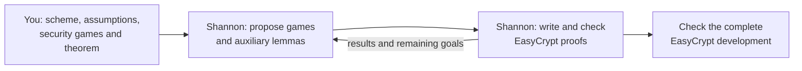

# Shannon Prover

**From a security theorem to an EasyCrypt proof.**

Shannon Prover uses language-model agents to construct machine-checked
cryptographic proofs in [EasyCrypt](https://www.easycrypt.info).
You supply the formal description of the scheme, its security assumptions,
and the theorem you want to prove. **Shannon Prover automates the search
for both the proof decomposition and the proofs of its individual lemmas.**
It can introduce intermediate games and auxiliary lemmas, try to prove them,
and revise the argument as EasyCrypt exposes what remains to be shown.

- **Paper:** [ShannonProver: Towards Automating Formal Cryptographic Proofs](https://arxiv.org/abs/2607.02847)
- **Website:** [project overview and proof browser](https://skyshannonprover.github.io/shannon-prover/)
- **Contact:** shannonprover@gmail.com · [GitHub](https://github.com/SkyShannonProver/shannon-prover)

## What does Shannon automate?

Think of formalizing a cryptographic security proof in three phases:

| Phase | Work to do | With Shannon Prover |
|---|---|---|
| **I — State the security problem** | Define the scheme, adversary, security games, assumptions, and final theorem in EasyCrypt. | You provide these. |
| **II — Build the security argument** | Choose intermediate games, formulate auxiliary lemmas, and connect them to the final theorem. | Shannon proposes and revises this decomposition. |
| **III — Prove each step** | Write the detailed EasyCrypt proofs of the lemmas and the final theorem. | Shannon searches for proof scripts and checks them with EasyCrypt. |

Phases II and III need not happen in a single forward pass. For example, while
trying to justify a game hop, Shannon may discover that a proposed invariant
is insufficient. It can refine the auxiliary lemma, try its proof again, and
then return to the main argument. This feedback between **designing the
argument** and **proving its steps** is what we mean by *interleaved*.

One agent works on the overall argument. It can write proofs directly and ask
other agents to work on selected auxiliary lemmas. Their results feed back
into the overall proof, which is checked again as a complete EasyCrypt file.


```mermaid
flowchart LR
    Input["You: scheme, assumptions,<br/>security games and theorem"] --> Plan["Shannon: propose games<br/>and auxiliary lemmas"]
    Plan --> Proof["Shannon: write and check<br/>EasyCrypt proofs"]
    Proof -->|"results and remaining goals"| Plan
    Proof --> Final["Check the complete<br/>EasyCrypt development"]
```

## Install

Use macOS or Linux with Git, [opam](https://opam.ocaml.org), Python ≥ 3.12,
and [uv](https://docs.astral.sh/uv/). Install `uv` outside the project's
`.venv` directory.

```bash
git clone https://github.com/SkyShannonProver/shannon-prover.git
cd shannon-prover
uv sync
uv run python tools/bootstrap_easycrypt.py
uv run python tools/bootstrap_easycrypt.py --verify-only
```

The bootstrap command installs the repository's pinned EasyCrypt
`r2026.06` environment. Shannon's Python commands use it automatically.

You also need the agent CLIs you select, installed and authenticated.
The current project-level configuration uses **Claude Code for the overall
argument and OpenAI Codex for auxiliary lemmas**. It requires their stored
Claude and ChatGPT OAuth logins. To use only Codex, pass
`--outer-provider codex --inner-provider codex` to the commands below.
See the [project-level proving guide](workflow/interleaved/README.md#choose-the-agents-and-limits)
for model settings, login requirements, and time limits.

<a id="prove-a-security-theorem"></a>

## Project-level proving

This workflow covers Phases II and III: Shannon constructs the proof
decomposition and the proofs needed to reach your project's final theorem.

Put your EasyCrypt target and its local dependencies in one directory under
`projects/`. The file should contain the security model and final theorem,
with an unfinished proof. You do not need to supply a decomposition into
auxiliary lemmas.

```text
projects/my-proof/
  Target.ec
  Dependency.ec
  interleaved_project.json
```

Create `interleaved_project.json` with the following contents, replacing the
file and theorem names with yours:

```json
{
  "schema_version": 1,
  "target_file": "projects/my-proof/Target.ec",
  "final_lemma": "TargetSecurity",
  "include_dirs": ["easycrypt-src/theories", "projects/my-proof"],
  "artifact_root": "artifacts/my-proof-interleaved",
  "max_parallel": 2,
  "max_inner_minutes": 120,
  "outer_timeout_seconds": 43200
}
```

This allows at most two auxiliary-lemma attempts at once, up to two hours
per attempt, and a twelve-hour overall task. These are time limits, not a
total spending cap. Adjust them before running.

Commit your project files and configuration: the runner requires a clean
Git working tree, including for the preliminary check. Then, from the
repository root, check the setup without starting a proof-generating model:

```bash
uv run python -m workflow.interleaved \
  --project projects/my-proof/interleaved_project.json \
  --preflight-only
```

If the check passes, run the same command without `--preflight-only`:

```bash
uv run python -m workflow.interleaved \
  --project projects/my-proof/interleaved_project.json
```

Shannon works on the target file in your checkout and prints the directory
containing the run's results. The [project-level proving guide](workflow/interleaved/README.md)
explains how to read the outcome, continue partial work, and add checks that
protect your original theorem and assumptions.

For a supplied cryptographic task, follow the
[ChaChaPoly example](experiments/interleaved_shannon/README.md). It includes
a security model and target theorem, without a human-supplied decomposition,
and uses stricter checks that preserve the supplied problem.

## What counts as a proof?

For an interleaved run, success requires a fresh EasyCrypt check of the
complete target file and no remaining `admit.` in that file. The run's
`manifest.json` records `status: "proved"` and
`final_verification_passed: true`; `final_verification.json` contains the
final checking result. A completed auxiliary lemma alone does not establish
the final theorem. A partial proof is reported as incomplete.

EasyCrypt checks the statements in the submitted development under its
assumptions. You should also review that these are the security statement and
assumptions you intended. The generic checker does not freeze the original
definitions or prohibit new assumptions; projects needing those restrictions
must supply additional checks. The ChaChaPoly example supplies them for its
fixed task.

<a id="prove-your-first-lemma"></a>

## Single-lemma proving

This workflow covers Phase III for a lemma you have already stated.

If you already know the decomposition, you can ask Shannon to prove
one lemma. Put its EasyCrypt file and local dependencies under `projects/`,
leaving the selected lemma with an unfinished proof, for example:

```easycrypt
lemma my_lemma : true.
proof.
  admit.
qed.
```

Run Codex from the repository and enter `$prove my_lemma`. In the Codex
desktop app, type `/` and choose **Prove** from the skills list.
It searches `projects/` first, then the bundled `eval/examples/`.
For example, the supplied PIR lemma can be launched with:

```text
$prove PIR_correct
```

Claude Code has the corresponding command:

```text
/prove PIR_correct
```

These commands prove a selected lemma; they do not start the interleaved
project-level workflow. The Codex command uses Codex, and the Claude command
uses Claude. A generated proof is written back only after a fresh EasyCrypt
verification succeeds. See the [Prove instructions](.agents/skills/prove/SKILL.md)
for the explicit-file command and other details.

## Examples and research evaluation

The [proof browser](https://skyshannonprover.github.io/shannon-prover/)
shows recorded **single-lemma** attempts and their checked steps. It does
not yet show the complete sequence of game choices, auxiliary-lemma attempts,
and revisions in an interleaved run.

### Research evaluation is a different workflow

You do **not** need `eval_suite` to run an ordinary proof on your own project.
Controlled evaluations additionally hide existing answers and fix the task,
models, and budgets so results can be compared.
Strict live evaluation currently requires Linux and `bubblewrap` when using
the isolated benchmark suite; the ChaChaPoly reference has its own documented
source-access policy. See the [benchmark guide](eval_suite/README.md) and
[ChaChaPoly reference guide](experiments/interleaved_shannon/README.md).

## Further reading

- [Project-level proving guide](workflow/interleaved/README.md): project setup, agents, limits, and results.
- [ChaChaPoly example](experiments/interleaved_shannon/README.md): reproduce the supplied security-proof task.
- [Architecture](docs/ARCHITECTURE.md): optional implementation details for contributors.

## License and citation

Shannon Prover is released under the [MIT License](LICENSE).
The vendored EasyCrypt source has its own MIT license.
If you use Shannon Prover in research, please cite [CITATION.cff](CITATION.cff):

```bibtex
@article{ma2026shannonprover,
  title   = {ShannonProver: Towards Automating Formal Cryptographic Proofs},
  author  = {Ma, Yiping and Tsai, Yu-Lin and Rathee, Mayank and Rathee,
             Deevashwer and Dupressoir, Fran\c{c}ois and Strub, Pierre-Yves
             and Popa, Raluca Ada},
  journal = {arXiv preprint arXiv:2607.02847},
  year    = {2026}
}
```
