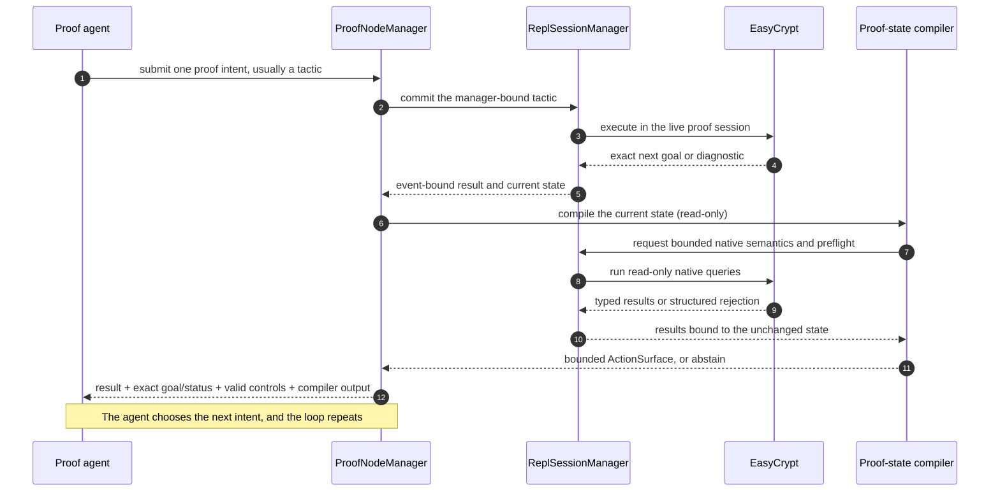
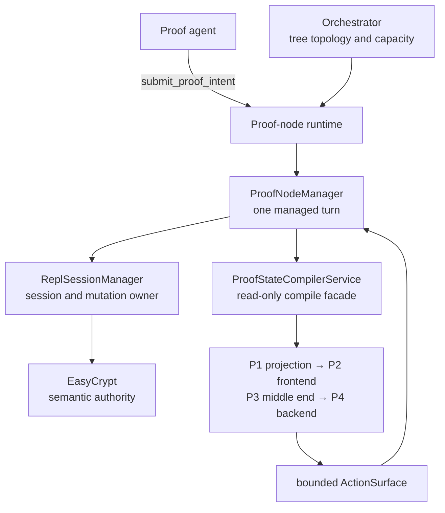

# Shannon Prover

**LLM agents that write machine-checked cryptographic proofs.**

Shannon Prover connects language-model agents to the
[EasyCrypt](https://www.easycrypt.info) proof assistant through managed proof
sessions and a proof-state compiler. The agent submits one proof intent per
turn; the manager applies it to EasyCrypt, returns the exact current goal and
any bounded compiler output, and accepts a proof only after fresh offline
verification.

- **Paper:** [ShannonProver: Towards Automating Formal Cryptographic Proofs](https://arxiv.org/abs/2607.02847)
- **Website:** [skyshannonprover.github.io/shannon-prover](https://skyshannonprover.github.io/shannon-prover/) — project overview and benchmark browser
- **Contact:** shannonprover@gmail.com · [github.com/SkyShannonProver/shannon-prover](https://github.com/SkyShannonProver/shannon-prover)

## What this tool does — and what you bring

A formal security proof moves through three phases (paper, Fig. 1):

| Phase | Who | What |
|---|---|---|
| **I — Security modeling** | expert | express the scheme and its security notions as EasyCrypt modules and definitions |
| **II — Lemma decomposition** | expert | decompose the main theorem into intermediate lemma statements and game hops |
| **III — Tactic-level lemma proving** | **Shannon Prover** | construct a tactic script that EasyCrypt accepts for each lemma |

**Shannon Prover's scope is Phase III**: you provide the security model and
lemma-level obligations; Shannon Prover searches for the tactic-level proof.
A stalled search can also indicate that the Phase II decomposition should be
revisited.

## The MCP tool

Shannon Prover talks to each proof agent through the
[Model Context Protocol](https://modelcontextprotocol.io). The agent gets one
tool, `submit_proof_intent`, and submits one proof-level action per turn:

```json
{"intent": "commit_tactic", "payload": {"tactic": "byequiv=> //."}}
```

The manager owns the live EasyCrypt session, state identity, checkpoints,
restarts, proof mutation, and view refresh. It advertises only controls that
are valid in the current state, such as committing a tactic, undoing, rewinding
to a checkpoint, restarting, amending a failed step, or finishing. The agent
never supplies session, node, view, or goal identities.

## The proof-state compiler

The default interface presents the exact EasyCrypt goal, the valid manager
controls, and—when applicable—a bounded `ActionSurface` produced by the
proof-state compiler. Compiler actions are tied to the current goal, checked
through EasyCrypt-native semantics, and certified before they are shown to the
agent.

The compiler helps with mechanical work after the agent has selected an
operation or commitment: binding arguments, realizing exact syntax, locating a
failure inside a compound tactic, or constructing a state-valid repair. It
does not rank proof strategies, choose a game hop, or hand the agent a proof
route.

### One managed turn

Every proof turn follows the same loop:


```mermaid
sequenceDiagram
    autonumber
    participant A as Proof agent
    participant M as ProofNodeManager
    participant S as ReplSessionManager
    participant E as EasyCrypt
    participant C as Proof-state compiler

    A->>M: submit one proof intent, usually a tactic
    M->>S: commit the manager-bound tactic
    S->>E: execute in the live proof session
    E-->>S: exact next goal or diagnostic
    S-->>M: event-bound result and current state
    M->>C: compile the current state (read-only)
    C->>S: request bounded native semantics and preflight
    S->>E: run read-only native queries
    E-->>S: typed results or structured rejection
    S-->>C: results bound to the unchanged state
    C-->>M: bounded ActionSurface, or abstain
    M-->>A: result + exact goal/status + valid controls + compiler output
    Note over A,M: The agent chooses the next intent, and the loop repeats
```

The manager and session path owns all proof mutation. The compiler never
drives the proof or reparses pretty-printed text as semantic truth: it projects
the current state, consumes EasyCrypt-native results, certifies any candidate
action in that unchanged state, and may show a bounded result for the agent's
next decision.

## Install

Prerequisites: macOS or Linux, [opam](https://opam.ocaml.org), Python ≥ 3.12,
[uv](https://docs.astral.sh/uv/), and the
[OpenAI Codex CLI](https://developers.openai.com/codex/cli/) installed and
logged in. Claude is available only when explicitly selected for an
experiment.

### 1. Python environment

Install `uv` outside this project's `.venv`, then synchronize the locked Python
environment:

```bash
uv sync
```

### 2. Repository-managed EasyCrypt

Shannon Prover is locked to EasyCrypt `r2026.06`. The bootstrap command creates
and verifies the repository-managed opam root and switch:

```bash
uv run python tools/bootstrap_easycrypt.py
uv run python tools/bootstrap_easycrypt.py --verify-only
```

Python entry points select this environment automatically. Only a developer
command that invokes `easycrypt` directly needs shell exports:

```bash
eval "$(uv run python tools/bootstrap_easycrypt.py --print-env)"
```

### 3. Agent login

```bash
codex --version
codex
```

Run `codex` from the repository. On first launch, choose **Sign in with
ChatGPT** or another available sign-in method.

## Choose the agent and model

The default proof-node agent backend is **OpenAI Codex**. Its default model is
`gpt-5.6-sol` with high reasoning effort. Agent backend and model are separate
settings: a run may explicitly select `codex` or `claude`, choose a model
available to that backend, and set its reasoning effort.

```json
{
  "agent_backend": "codex",
  "model": "gpt-5.6-sol",
  "effort": "high"
}
```

The same settings are available on a direct orchestrator run:

```bash
--agent-backend codex \
--prover-model gpt-5.6-sol \
--prover-effort high
```

When changing the backend, select a model supported by that backend and make
sure its CLI is installed and authenticated.

## Prove your first lemma

Create one subdirectory under [`projects/`](projects/) for your EasyCrypt
project. Put the target file and that project's `.ec`/`.eca` dependencies
directly in that directory. For example:

```text
projects/
  my-proof/
    Target.ec
    Dependency.ec       # if Target.ec requires it
```

Leave the target lemma in `projects/my-proof/Target.ec` with an unfinished
proof, for example:

```easycrypt
lemma my_lemma : true.
proof.
  admit.
qed.
```

Run Codex from the repository, then invoke the repo-scoped Prove skill with the
lemma name:

```text
$prove my_lemma
```

In the Codex desktop app, type `/` and choose **Prove** from the skills list.
The skill locates the declaration, starts one managed proof node with the
default proof-state compiler, and works directly on your source file. It does
not enable evaluation mode, copy the project, or strip an existing proof.
It searches `projects/` first. If no matching declaration is found there, it
also searches the repository's checked-in examples under `eval/examples/`.

The agent submits tactics only through `submit_proof_intent`. Shannon writes a
new proof into the target file only after the winning candidate passes a fresh
offline EasyCrypt verification. If the lemma already has a complete verified
proof, the run reports that fact and leaves it unchanged.

### Codex and Claude commands

Codex and Claude Code expose the same one-argument launcher interface. Each
entry point is permanently bound to its own proof-node backend. Codex uses the
repository skill at
[.agents/skills/prove/SKILL.md](.agents/skills/prove/SKILL.md):

```text
$prove PIR_correct
```

Claude Code provides the matching project command through
[.claude/commands/prove.md](.claude/commands/prove.md):

```text
/prove PIR_correct
```

Both launchers follow the same canonical workflow, but `$prove` always launches
a Codex proof node and `/prove` always launches a Claude proof node. Neither
command accepts a backend argument.

For an explicit file path, backend, or model, use the lower-level orchestrator
directly. This is the same ordinary, non-evaluation workflow used by the
commands above:

```bash
uv run python -m workflow.orchestrator \
  --file projects/my-proof/Target.ec \
  --lemma TargetLemmaName \
  --include-dir easycrypt-src/theories \
  --surface-profile proof_state_compiler \
  --agent-backend codex \
  --prover-model gpt-5.6-sol \
  --prover-effort high
```

For a multi-file project, keep all project-owned `.ec`/`.eca` dependencies in
the same `projects/my-proof/` directory. The runtime automatically adds the
target file's directory to EasyCrypt's include path. EasyCrypt's standard
library remains under `easycrypt-src/`; do not copy it into your project. The
run directory is printed at startup. A completed run also writes a replayable
bundle under `agent_view_runs/` containing the turn-by-turn agent view,
submitted intent, manager result, and reconstructed committed proof.

## Research evaluation is a different workflow

You do **not** need `eval_suite`, source isolation, proof stripping, or
bubblewrap to use Shannon Prover on your own lemmas. Those mechanisms exist for
controlled research evaluation, where the question is whether an agent can
reconstruct a proof without reading the target's existing answer or prior run
artifacts.

An evaluation suite therefore:

- copies the target project into an isolated output directory;
- strips the target proof while retaining the statement and allowed siblings;
- confines the model process away from the original checkout and cached proofs;
- freezes model, compiler exposure, budgets, and tree settings across arms; and
- records metrics without writing the generated proof back to the original
  benchmark source.

The checked-in PIR suite is a research-evaluation example:

```bash
uv run python -m eval_suite.run \
  --suite eval_suite/suites/demo_pir.json \
  --dry-run

uv run python -m eval_suite.run \
  --suite eval_suite/suites/demo_pir.json
```

Strict live evaluation currently requires Linux and `bubblewrap` for the
negative filesystem-visibility guarantee. On macOS, ordinary `$prove` and
`/prove` runs work normally, but a strict eval suite fails closed before
launching the model. See [`eval_suite/README.md`](eval_suite/README.md) and
[`TESTING.md`](TESTING.md) for evaluation protocols and remote-run discipline.

### Did it actually prove it?

- A run is successful only when the canonical `ProverResult` is `verified`.
- The committed proof must contain no `admit.` and must pass a fresh offline
  EasyCrypt verification.
- Ordinary proof runs write back only after that verification succeeds.
- Evaluation runs write only to their isolated copy and metrics directory.
- If an OS sandbox blocks `why3server` from using `nice()`, run the bounded
  EasyCrypt/SMT command outside that sandbox.

## Benchmark browser

The hosted benchmark browser is available on the
[project website](https://skyshannonprover.github.io/shannon-prover/). To browse
local bundles:

```bash
python3 bundle_browser/build_manifest.py
python3 -m http.server 8000
# open http://127.0.0.1:8000/bundle_browser/
```

Use `python3 bundle_browser/build_manifest.py --public` to generate a manifest
containing only the public source allowlist.

## Architecture


```mermaid
flowchart TD
    Agent["Proof agent"] -->|"submit_proof_intent"| Runtime["Proof-node runtime"]
    Orchestrator["Orchestrator<br/>tree topology and capacity"] --> Runtime
    Runtime --> Manager["ProofNodeManager<br/>one managed turn"]
    Manager --> Session["ReplSessionManager<br/>session and mutation owner"]
    Session --> EasyCrypt["EasyCrypt<br/>semantic authority"]
    Manager --> Compiler["ProofStateCompilerService<br/>read-only compile facade"]
    Compiler --> Passes["P1 projection → P2 frontend<br/>P3 middle end → P4 backend"]
    Passes --> Actions["bounded ActionSurface"]
    Actions --> Manager
```

The orchestrator owns proof-search topology and winner selection. The manager
owns one agent turn and binds intents to current state. `ReplSessionManager` is
the sole EasyCrypt session and mutation owner. The compiler is read-only;
EasyCrypt remains authoritative for parsing, typing, resolution, matching,
proof state, and tactic acceptance.

See [`docs/ARCHITECTURE.md`](docs/ARCHITECTURE.md) for the contributor overview,
[`docs/design/proof_state_compiler_v2.md`](docs/design/proof_state_compiler_v2.md)
for the compiler design, and [`TESTING.md`](TESTING.md) for validation and
experiment discipline.

## Main directories

```text
core/easycrypt/       EasyCrypt runtime, events, native adapters, compiler core
workflow/             orchestrator, proof-node manager/runtime, compiler service
projects/             user-owned EasyCrypt projects (one subdirectory each)
eval/examples/        public EasyCrypt benchmark corpus
eval_suite/           isolated benchmark runner and checked-in suites
agent_view_runs/      curated, replayable run bundles
bundle_browser/       static benchmark-browser application
tools/                bootstrap, audit, and developer utilities
tests/                deterministic test suite
easycrypt-src/        vendored upstream EasyCrypt (its own MIT license)
```

Generated outputs belong under `artifacts/` or `workflow/runs/`; both are
gitignored.

## License and citation

Shannon Prover is released under the [MIT License](LICENSE). The
`easycrypt-src/` directory vendors upstream EasyCrypt under its own MIT
license.

If you use Shannon Prover in your research, please cite
[`CITATION.cff`](CITATION.cff):

```bibtex
@article{ma2026shannonprover,
  title   = {ShannonProver: Towards Automating Formal Cryptographic Proofs},
  author  = {Ma, Yiping and Tsai, Yu-Lin and Rathee, Mayank and Rathee,
             Deevashwer and Dupressoir, Fran\c{c}ois and Strub, Pierre-Yves
             and Popa, Raluca Ada},
  journal = {arXiv preprint arXiv:2607.02847},
  year    = {2026}
}
```

Shannon Prover is a research prototype. Issues and discussion are welcome at
[github.com/SkyShannonProver/shannon-prover](https://github.com/SkyShannonProver/shannon-prover)
or shannonprover@gmail.com.
