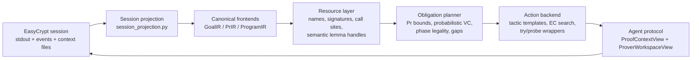
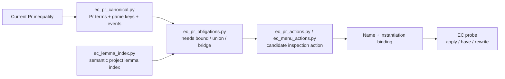
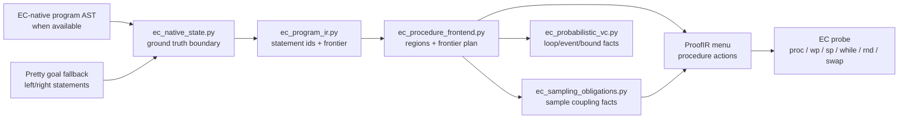
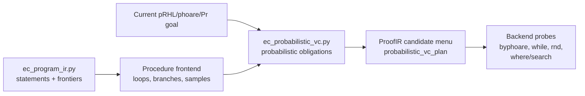
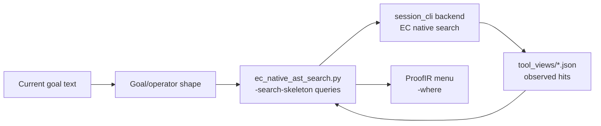
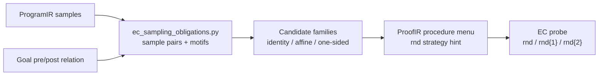
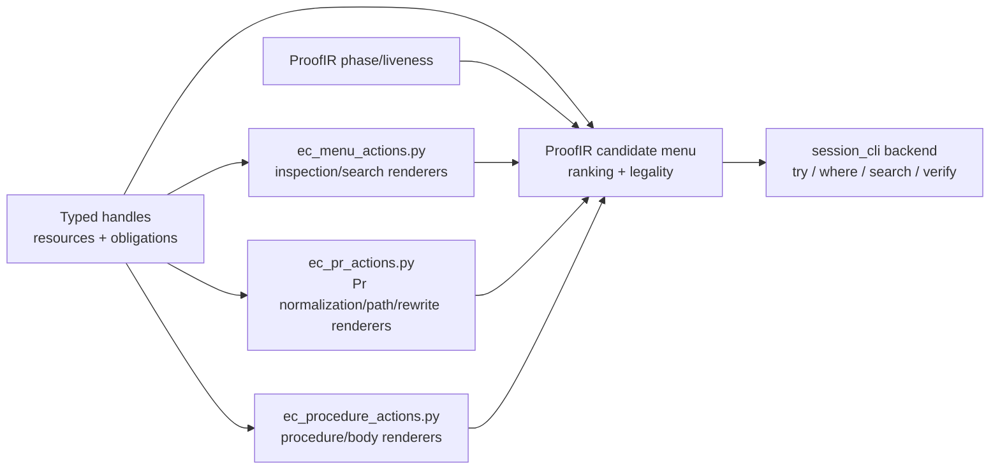

# EasyCrypt Analysis Compiler Layer

This directory is the compiler-like analysis layer between raw EasyCrypt proof
state and prover-facing actions.  Its job is to turn textual EC goals and
project declarations into typed facts, resources, obligations, and tactic
candidates.

## Main Architecture

The intended flow is:

1. Parse raw EC state into canonical IR.
2. Resolve project resources against that IR.
3. Derive obligations and legal proof moves.
4. Render a small action menu, with EC probes only at the backend boundary.

The layer-by-layer commitments are pinned in
[`CONTRACTS.md`](CONTRACTS.md). Core typed fact shapes are inventoried in
[`SCHEMAS.md`](SCHEMAS.md). Future agents adding compiler behavior should start
with [`EXTENDING.md`](EXTENDING.md), which maps features to the right pass
before touching ProofIR. Project-facing lemma declaration guidance lives in
[`LEMMA_AUTHORING.md`](LEMMA_AUTHORING.md). When adding new analysis behavior,
update the contract/schema or add the new fact to the right layer before
extending ProofIR.

## Current Ownership

`session_projection.py` and `ec_native_state.py` are the state boundary. They
prefer EC-native goal/program artifacts when present and label stdout parsing
as fallback evidence.

`ec_goal_parser.py` is the raw goal fallback frontend. It classifies EC goal
text and extracts coarse structural fields from stdout.

`ec_pr_canonical.py` is the shared canonical frontend for `Pr[...]` terms. It
owns balanced probability-term parsing, memory/event splitting, procedure
endpoint extraction, and game keys. Other passes should consume these records
instead of re-parsing `Pr` syntax locally.

`ec_program_ir.py` is the program-shape frontend. It normalizes EC-native or
fallback statement facts into calls, control-flow frontier data, procedure
names, and callable lemma handles.

`ec_procedure_frontend.py` is the procedure/control-flow frontend. It consumes
ProgramIR statements and classifies branch guards, loop frontiers, sample
frontiers, straight-line prefixes, wrapper/init calls, swap opportunities, and
the next structural frontier plan.

`ec_name_resolution.py` and `ec_instantiation_binding.py` are the resource
binding layer. They map names and lemma declarations to typed slots, candidate
values, instantiated tactic templates, and conservative evidence.

`ec_lemma_index.py` is the semantic declaration index. It scans visible project
and imported declarations, classifies Pr equality, Pr inequality, additive
bound, event-union, and bad-event resources, and exposes candidates by semantic
shape rather than by naming convention.

`ec_pr_elaborator.py` is a specialized Pr resource elaboration pass. It uses
canonical Pr terms to keep lemma instantiation arguments separate from concrete
procedure endpoints.

`ec_pr_obligations.py` is the Pr middle-end obligation planner. It classifies
normalization shells, additive/union-bound structure, arithmetic chains,
semantic bound lookup, and native-search needs as typed obligations.

`ec_pr_bridge_frontend.py` is the typed Pr bridge planner. It derives
wrapper-to-MainD, typed adapter, synthetic bridge, and structural bridge facts
from current endpoints and visible declarations; ProofIR consumes those facts
instead of synthesizing bridge routes inline.

`ec_equiv_closers.py` is the equiv exact-closer resource pass. It finds
project-local equiv lemmas whose conclusion already matches the current
pRHL/equiv procedure pair.

`ec_probabilistic_vc.py` is the probabilistic VC frontend. It classifies
bad-event reductions, query-counter bounds, loop/event preservation, bounded
phoare sequence cuts, sampling/coupling obligations, and final Pr
loss-accounting as typed obligations.

`ec_sampling_obligations.py` is the sampling/coupling frontend. It canonicalizes
visible samples, pairs same-distribution samples before fallback, classifies
identity/translation/conditional/one-sided coupling motifs, and records the
distribution facts likely needed by a later EC probe.

`ec_native_ast_search.py` is the EC-native search frontend. It derives
conservative `-search-skeleton` queries from canonical goal/operator shape and
consumes prior search tool artifacts as typed `-where` inspection candidates.

`ec_menu_actions.py` is the first extracted action rendering layer. It renders
read-only/inspection menu items such as ambient exact closers, semantic Pr
bound lookups, and native AST search actions from already-computed handles.

`ec_action_contracts.py` defines the stable ActionCandidate readiness/effect
contract used by action renderers and ProofIR.

`ec_pr_actions.py` renders Pr-layer action menu items such as normalization,
direct bridge obligations, Pr rewrites, path plans, partial paths, arithmetic
bound chains, and conservative `byequiv` fallbacks from already-computed Pr
handles. It should not search for lemmas or parse new goal text.

`ec_procedure_actions.py` renders procedure/body menu items such as `wp`, `sp`,
`if`, `rcondt`, `rcondf`, `while`, `splitwhile`, `rnd`, `swap`, and residual
closers from the typed procedure frontend and sampling obligations.

The candidate menu is emitted in structural build order; the only factual
re-ordering is the Pr-bridge chain applied by `_order_instantiated_pr_bridges`
(`ec_proof_action_surface.py`). There is no heuristic ranker/scheduler pass —
the former `ec_action_ranker.py` was removed (its preference/cap/confidence
policy was net-neutral for the agent surface).

`ec_pr_path_planner.py`, `ec_dataflow_invariant.py`, and small hint modules are
additional obligation/planning passes. They should describe proof intent and
required resources rather than directly committing fragile tactic strings.

`ec_proof_ir.py` is currently the facade that assembles many of these results
for AgentView. Long term, it should become thinner: orchestration and summary
composition belong there, while parsing, resource search, scoring, and tactic
rendering should live in focused modules.

`../search/` and `session_cli.py` are backend/tool boundaries. Native EC search,
`-where`, `-members`, tactic forms, probes, and verification belong there,
because they depend on an active EasyCrypt subprocess.

## Cleanup Rules

A new analysis pass should normally emit typed JSON-like facts, not prose and
not final tactics. Tactic strings are acceptable only at the action backend or
compatibility boundary.

Prefer canonical IR fields over source-text regex when the information is
already parsed. For probability goals, use `ec_pr_canonical.py`; for program
shape, use `ec_program_ir.py`; for names and signatures, use
`ec_name_resolution.py`.

When a heuristic grows a project-specific name convention, split it into two
parts: a semantic detector that says what the goal needs, and a resource lookup
that finds project-local declarations. The detector should not know names like
`PLog`, `BR93`, or `PRG` unless those names appear in the current EC context.

When native EasyCrypt search is useful, route it through the backend/tool layer
and cache the result as typed evidence. Do not make frontend canonicalization
depend on a live EC subprocess.

## Compiler Smoke Matrix

`tests/test_compiler_smoke_matrix.py` is the fast offline guardrail for this
layer. It does not run EasyCrypt proof search; it builds ProofIR from current
goals plus visible declarations and checks that compiler facts survive across
benchmark lemma styles.

The matrix should grow by benchmark family, not by individual tactic failure.
Each row should cover the same three boundaries:

1. semantic resource recall, such as a project-local Pr bound lemma found by
   declaration shape rather than by name prefix
2. middle-end obligation planning, such as Pr union/bound/native-search facts
3. action rendering, such as Pr-layer plans or `-where` lookups appearing
   before generic pRHL lowering

This is the regression test for the "not hard-coded to ChachaPoly/BR93/PRG"
claim. If a new project writes lemmas in a new style, add the real source row
and a small style-variant fixture before tuning heuristics.

## Pr Bound Lookup Flow

The key boundary is that semantic lookup ends at an inspection action. The Pr
action renderer can expose the candidate, but a bound lemma is not considered
runnable until name resolution and instantiation binding have checked the
declaration shape.

## Procedure Control Flow

The procedure frontend answers "what structural region is next?" without
choosing a final tactic. Procedure menu rendering lives in
`ec_procedure_actions.py`; ProofIR still owns ordering, phase legality, recent
failures, and resource liveness.

## Probabilistic VC Flow

This flow deliberately separates obligation recognition from tactic selection.
The VC frontend may say "this is loop bad-event loss accounting"; it should not
decide a project-specific lemma name or commit an `apply` form.

## Native Search Flow

The frontend may propose native EC search or consume previous hits, but it does
not apply those hits. A hit becomes a read-only inspection action until the
signature and instantiation shape are known.

## Sampling Coupling Flow

Sampling classification remains generic: it talks about relation motifs and
distribution evidence, not project-specific lemma names or hard-coded masks.

## Action Rendering Flow

The action layer should render facts into stable menu-item JSON. It should not
discover new semantic facts, and it should not decide that a read-only lookup is
a runnable proof tactic.

## Near-Term Main Lines

1. Keep extracting canonical frontends from `ec_proof_ir.py`.
2. Expand the semantic lemma index over project declarations.
3. Make Pr bound/union planning depend on semantic handles, not lemma names.
4. Keep `ec_proof_ir.py` as the assembler and compatibility surface.
5. Add smoke tests per benchmark family for the compiler facts before testing
   full proof search.
