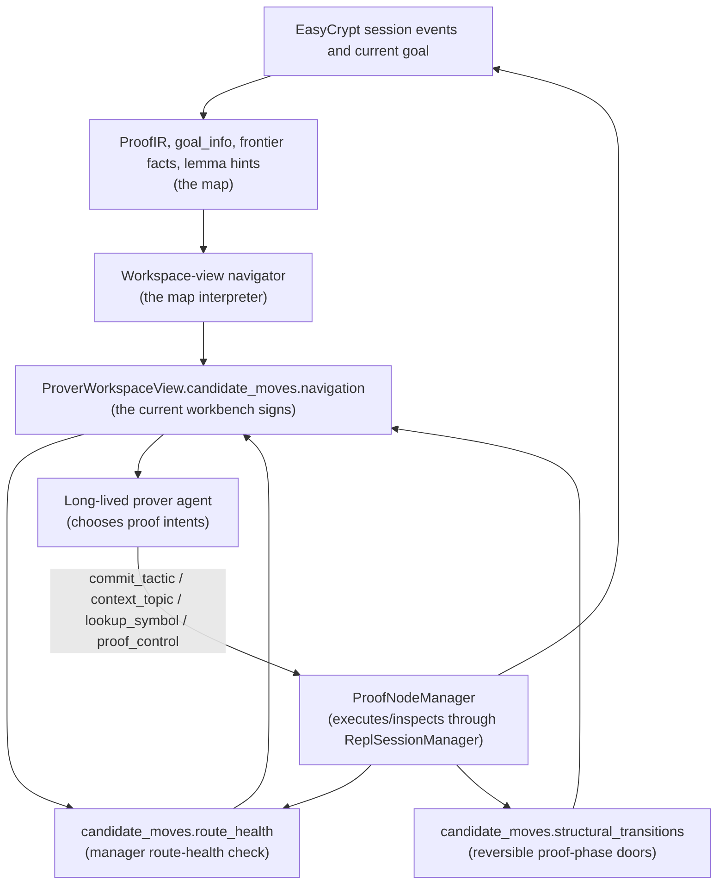
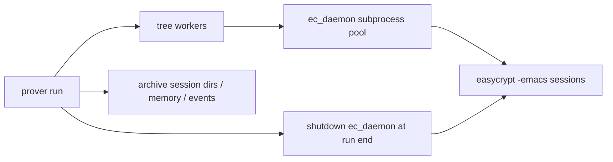

# Multi-Agent Proof Improvement Workflow

**Created:** 2026-04-08  
**Updated:** 2026-06-14

> **STATUS — partially superseded.** The self-improvement loop described below
> (Phase 2 ANALYZE / Phase 3 IMPROVE / Phase 3b REGRESSION / Phase 4 REPORT and
> their agents `trace_analyst.py`, `kb_improver.py`, `minitool_improver.py`,
> `regression_tester.py`, `report_writer.py`) has been **removed**. The live
> pipeline is now single-pass: **Phase 0 (deterministic research) → Phase 1
> (prove)**, then post-run validation bundles. Sections describing the removed
> phases are kept for historical design context only — treat the module tree
> below and `orchestrator.py` as the source of truth for what runs today.

## Vision

Automate the cycle of: plan a proof → prove a lemma → analyze what went wrong → improve KB/tools → re-prove.
This workflow replaces the manual loop with a deterministic orchestrator plus specialized agents and Python validators.

**End goal:** An agent backed by Opus + KB + mini tools that can tackle complex EasyCrypt proofs
(e.g., ML-KEM level). The workflow is the engine that continuously improves the agent's capabilities.

---

## Agent Model Assignments

| Agent | Model | Reasoning |
|-------|-------|-----------|
| **Proof Research** | Pure Python (no LLM) | Instant context extraction, KB search, difficulty classification |
| **Prover** | Opus 4.6 | Hardest job — deep EasyCrypt tactic reasoning + self-report |
| **Trace Analyst** | Sonnet 4.6 (optional) | Pre-filled template; LLM only fills stuck_reason + suggestions. Default: skipped (prover self-report) |
| **KB Improver** | Sonnet 4.6 | Create/edit knowledge base entries |
| **Minitool Improver** | Sonnet 4.6 | Create/edit Python tool code |
| **Report Writer** | Haiku 4.5 (analysis only) | Python builds boilerplate; LLM handles stuck points + open questions |

---

## Architecture Overview

```
                    ┌──────────────────────────────────────┐
                    │           ORCHESTRATOR                │
                    │                                      │
                    │  Input: target lemma(s)              │
                    │  Controls: timeout, loop, terminate  │
                    │  Output: lab_note + optional          │
                    │          proof_bank entry             │
                    └──────┬───────────────────────────────┘
                           │
            ┌──────────────┼──────────────────┐
            │    Phase 0: RESEARCH (Python)   │
            │  Pure Python — no LLM call:     │
            │  - Read .ec file, extract lemmas │
            │  - Search KB for patterns        │
            │  - Classify difficulty (5 levels)│
            │  - Build context brief           │
            │  Instant (~1s)                   │
            └──────────────┼──────────────────┘
                           │
                    Current default:
                    all difficulty levels → tree mode
                           │
            ┌──────────────┼───────────────────────────────────┐
            │         Phase 1: PROVE                         │
            │                                                │
            │  Legacy "racing" requests are normalized to    │
            │  multiple long-lived tree root nodes.          │
            │                                                │
            │  MODE B: "tree" (current default)              │
            │       ┌─ 0.0 ──── 0.0.0 (child from undo)     │
            │  root─┤                                        │
            │       └─ 0.1 ──── 0.1.0 (child from gap)      │
            │   configured initial provers from root         │
            │   structural undo → repair window, then child  │
            │   progress gap → kill only outside repair      │
            │   each node: ProofNodeRuntime + MCP submit     │
            │   max 4 concurrent, 300s min-alive protection  │
            │   children get: parent goal + discoveries      │
            │   + layer-move action (up/same/down)           │
            │   + failed-experiment memory                   │
            │                                                │
            │   Session ID captured from stream-json output  │
            │   Verification: full-file → extracted → event  │
            │                 contract / replay artifacts    │
            │   On ordinary success: optional proof_bank     │
            └──────────────┼─────────────────────────────────┘
                           │
            ┌──────────────┼──────────────────────────────┐
            │       Phase 2: ANALYZE                      │
            │                                             │
            │  Default (analyst_mode=skip):               │
            │    Python builds AnalysisReport from        │
            │    prover's PROVER REPORT + trace stats.    │
            │    No LLM call — instant.                   │
            │                                             │
            │  Optional (analyst_mode=always|auto):       │
            │  ┌───────────────────────────────┐          │
            │  │  TRACE ANALYST (Sonnet)        │          │
            │  │  Pre-filled template; LLM fills│          │
            │  │  stuck_reason + suggestions    │          │
            │  └───────────┬────────────────────┘          │
            │    analysis_report.json                      │
            │    5 suggestion types: kb_modify, kb_add,   │
            │    tool_modify, tool_add, needs_human       │
            └──────────────┼──────────────────────────────┘
                           │
            ┌──────────────┼──────────────────────────────────┐
            │          Phase 3: IMPROVE (parallel)            │
            │                                                 │
            │  ┌──────────────────┐  ┌──────────────────────┐ │
            │  │  MINITOOL        │  │ KB IMPROVER          │ │
            │  │  IMPROVER        │  │                      │ │
            │  │                  │  │                      │ │
            │  │ tool_modify:     │  │ kb_modify:           │ │
            │  │  fix/enhance     │  │  edit existing       │ │
            │  │ tool_add:        │  │ kb_add:              │ │
            │  │  create new tool │  │  create new entry    │ │
            │  └────────┬─────────┘  └─────────┬────────────┘ │
            │           │                      │              │
            │      tool_changes           kb_changes          │
            └──────────────────┬──────────────────────────────┘
                               │
            ┌──────────────────┼──────────────────────────
            │     Phase 3b: REGRESSION TEST
            │     (replay proof_bank entries via session_cli)
            │     Smart sampling: prioritize entries whose
            │     KB patterns overlap with changed patterns
            └──────────────────┬──────────────────────────
                               │
            ┌──────────────────┼──────────────────────────────┐
            │            Phase 4: REPORT                      │
            │                                                 │
            │  Python: header, stats, benchmark metrics,      │
            │          changes list, regression results        │
            │  LLM (Haiku): stuck points, open questions      │
            │          reconciliation ([ADDRESSED]/[OPEN]),    │
            │          human tasks, next steps                 │
            │                                                 │
            │  Lab notes APPEND across iterations (not overwrite)
            └─────────────────────────────────────────────────┘
                               │
                    ORCHESTRATOR decides:
                    ├─ proved + no improvements           → done
                    ├─ proved + improvements + reg passed  → done
                    ├─ proved + improvements + reg failed  → done (warning)
                    ├─ failed + improvements               → re-prove (next iteration, max 2)
                    └─ failed + no improvements            → stop
                    
                    Regression sub-loop (only when proved + has changes):
                    ├─ re-prove with new KB/tools → passed → done
                    └─ failed → fix KB/tools → retry (max 2 retries)
```

## Structured Session Events and Replay

The proof workflow treats backend EasyCrypt output as display/debug output and
the session event log as the machine-readable state channel. Each EasyCrypt
session can write `events.jsonl`, an append-only stream containing lifecycle
events, tool calls, tactic submission/results, goal changes, candidate proof
closure, and final verification.
Read-only tools may additionally persist ToolView artifacts. The full aggregate
proof-context artifact, `ProofContextView`, is produced by the backend
agent-view command and as a best-effort post-commit snapshot after mutating
session actions. It separates authoritative `proof_state` from typed analysis,
evidence, diagnostics, and latest errors.
For managed prover runs, `ProofNodeManager` is the workflow-owned visible
interface. It coordinates the internal `ReplSessionManager` for
lifecycle/mutation and delegates display policy to the core EasyCrypt
workspace-view layer. The agent sees one authoritative `ProverWorkspaceView`
and responds with proof-level JSON intents; it does not receive backend
commands, session directories, node ids, or state hashes as responsibilities.
In prover mode, each worker process hosts a long-lived proof-node runtime: one
`ProofNodeManager` plus one Claude agent session for that node. The agent stays
alive across turns, keeps its own working memory, and calls the structured
`submit_proof_intent` MCP tool with the unchanged JSON proof intents. The MCP
server is per-node and proxies to the runtime's private manager bridge; bridge
sockets, tokens, runtime clients, and shell submit scripts are not
agent-facing. The old shape where a worker launched `claude -p --resume` once
per proof turn is not a fallback path.
Legacy flat `racing` requests are routed to multiple tree root nodes so no
prover path launches Claude outside `ProofNodeRuntime`.
Historical lookup is optional file reading from the current node's curated
`node_memory/...` directory; history is not added to the
`ProverWorkspaceView` panel.

### Navigation Responsibility Boundary

Hypothesis-driven navigation belongs to the workspace-view projection layer.
It is not a second proof authority and it is not a prompt-side script.  The
picture is:



The reader metaphor is:

| Metaphor | Field or module | Read it as |
|---|---|---|
| Map | ProofIR, ToolViews, `program_frontier`, `application_context` | The current proof terrain: goal family, frontier, handles, facts, and gaps. |
| Navigator | `candidate_moves.navigation` | Trail signs for this exact view, never a global proof script. |
| Workbench | `ProverWorkspaceView` | The live IDE panel where the prover decides the next proof intent. |
| Surgery table | pRHL mid-surgery and branch/call frontier navigation | Local branch/suffix work after the main opener has exposed a delicate frontier. |
| Preview window | `probe_tactic`, `last_result.probe_preview`, `candidate_moves.probe_alternatives`, `call_subgoals` | Reversible checks before changing committed EasyCrypt state. |
| Vital signs | `candidate_moves.route_health` | Manager diagnosis of route trouble visible in this node now. |
| Phase door | `candidate_moves.structural_transitions` | A reversible entrance into a new proof phase, such as post-`wp` surgery. |

ProofIR and source facts are the map: they describe current goal family,
frontier shape, live handles, name-resolution evidence, and local hints.
The navigator is the map interpreter inside `WorkspaceViewManager` projection:
it reads only the current completed snapshot and emits up to three
state-conditioned navigation hypotheses.  Each navigation adapter owns one
small route family, such as module-equivalence opener, top-level probability
to phoare, one-sided hoare/phoare frontier, ambient local-lemma obligations, or
pRHL branch/call frontier.  Larger pRHL proofs may then enter a mid-proof
surgery episode: forced branch conditions (`rcondt`/`rcondf`), statement
reordering (`swap`), indexed suffix work (`wp`), post weakening (`conseq`),
and one-sided samples (`rnd{1}`/`rnd{2}`).  If those local obligations reveal
facts that should have been preserved earlier, the repair path is branch-local
rewind to the relevant call/loop invariant checkpoint, not destructive fresh
restart.  The output is advisory and current-view-only: route, confidence,
anti-routes, bounded fast-track probe, and repair path.

The workbench is the `ProverWorkspaceView`.  It shows the current authoritative
goal plus the navigator's signs for this exact state.  The agent still owns
proof choices and must submit ordinary manager intents.  The manager still owns
intent handling, metadata binding, semantic inspection, and view refresh.
When node-local evidence shows route trouble, the manager may add
`candidate_moves.route_health`: a compact current-route diagnosis such as
possible boundary gap, frontier placement trouble, `conseq` post-compression,
or local-tool-not-ready.  This is not a history panel and not a proof script:
it can say that a previous boundary may need to be revisited, show a
boundary-vs-residual concept diff, point to a rewind menu or inspection, and
list context lookups, but it must not decide the new invariant content for the
agent.  In L4 views, `pure_tail_surface` also records pure residual structure
after program-frontier work has disappeared: sampling side conditions,
finite-map update/projection facts, memory-decoration translation, and
map/list alignment gaps linked to reversible boundaries when visible.
Reversible proof-phase entrances live separately in
`candidate_moves.structural_transitions`: the navigator offers a small current
view menu of probeable doors, and accepted probe results use the same
`structural_transition` surface to ask whether the agent wants to enter the
real post-commit workbench.
Accepted read-only probes can also be carried forward under
`candidate_moves.probe_alternatives`.  This is the preview tray on the surgery
table: it records which trial moves EasyCrypt accepted or rejected on the
current state, summarizes the speculative after-goal, and lets the prover
commit the exact accepted move only when the phase transition is desired.
The `call_subgoals` inspect topic is the invariant preview table for
`call (_: Inv)`: it shows the obligations created by a concrete invariant
before the branch commits to that boundary.
`ReplSessionManager` remains the only component that mutates or probes
EasyCrypt state.  Runtime and prompt text explain how to use navigation, but
they must not hardcode lemma-specific proof scripts or derive proof-state
strategy themselves.

Mutating commands also persist a command-level `CommitResponse` artifact and
emit `commit.response.produced`, so workflow code can inspect attempted
tactics, accepted counts, failures, rollback behavior, post-state, and the
linked ProofContextView without parsing display text.
The upper workflow reads those facts through `workflow.session_observer` and
`workflow.proof_node_manager`, which build validated snapshots for race/tree
progress tracking. Those snapshots are now the workflow-facing view of
candidate readiness, committed tactic count, active tools, latest
ProofContextView, latest ProverWorkspaceView, latest CommitResponse, and
artifact-contract errors.

Above the event/projection layer, ProofContextView now also exposes typed
ProofIR from `core.easycrypt.analysis.ec_proof_ir`: current abstraction layer,
goal kind, live call-site/lemma handles, destructive moves, phase legality/cost
guidance, and invariant skeletons derived from pRHL postconditions. This is the
compiler analysis surface; raw EC goal text remains available, but it is no
longer the only entry point for layer decisions. Phase legality is where the
pipeline records compiler-style ordering constraints such as "preserve
potential call handles before global inline" and annotates candidates with the
handles they would preserve or kill. ProofIR delegates program-shape analysis to
`core.easycrypt.analysis.ec_program_ir` for the program-structure side of the
analysis: shallow parsed statements are normalized into stable statement and
call-site records, annotated with EasyCrypt's current last-call frontier, and
diffed into a conservative edit script. This is the first pass that separates
"this lemma handle is live somewhere in the program" from "this call lemma is
callable now." ProofIR then combines frontier facts with name/signature facts
into a `call_candidate_kind`: only `direct_current_call` becomes a current
`call L.` probe candidate. `needs_frontier_exposure`,
`future_oracle_subgoal_handle`, and `source_lookup_landmark` remain route
context or lookup handles; they should not compete with invariant calls,
frontier surgery, or local repair moves. The edit script records aligned call
pairs, shifted call pairs, and frontier blockers so candidate ordering can
follow program structure instead of dictionary order.
For the name/type side, ProofIR delegates static name resolution to
`core.easycrypt.analysis.ec_name_resolution`, which maps candidate lemma handles
to local declarations when possible and otherwise emits read-only lookup
requests before the agent guesses module/type arguments. If a prior signature
ToolView already recorded the exact declaration, the pass consumes that artifact
and upgrades the handle to "signature known" so the next candidate can focus on
instantiation rather than rediscovery. Signature parameters are lowered into
typed instantiation slots (module, type, value, memory) and conservative tactic
templates, which is the first type-checker-style bridge from a lemma name to an
executable proof action. `core.easycrypt.analysis.ec_instantiation_binding`
then searches the current source context and parsed goal for candidate slot
values, such as declared modules, functor arguments in live call sites, and
memory tokens from Pr goals. When all angle-bracket placeholders are eliminated,
ProofIR emits the bound tactic as an `instantiated_template` probe candidate
(for example `rewrite (lemma A &m).` or `call (equiv RO).`). ProofContextView may
surface those concrete candidates alongside older producers, but they remain
non-mutating probe intents until EasyCrypt accepts them.

For probability and advantage goals, ProofIR also delegates Pr-level path
planning to `core.easycrypt.analysis.ec_pr_path_planner`. This pass views
`pr_*` rewrite lemmas as bidirectional equality edges and scanned reduction /
bound lemmas as directed inequality edges, then searches for a short game path
from the current Pr source to the target game. The result is a strategy-level
plan such as `Game0 -> Game1 -> OW`, with lemma order and edge direction, not a
blind runnable tactic. Name resolution and bridge probes still decide whether
each hop is executable.

For call/loop invariants, ProofIR delegates invariant skeleton generation to
`core.easycrypt.analysis.ec_dataflow_invariant`. This pass mirrors EasyCrypt's
native variable-access machinery (`EcPV.s_read`, `EcPV.s_write`, `PV.fv`, and
the equality-generation idea in `EcPhlTrans.t_equivS_trans_eq`): start from
postcondition variables, walk parsed statements backward, and add common
code-read variables as equality candidates. The result is still a lightweight
agent-facing skeleton, not a replacement for EasyCrypt's typed checker.

Rejected tactics are also translated through the same compiler surface.
`core.easycrypt.analysis.ec_proof_diagnostics` consumes ProofIR plus the latest
failed tactic/error and emits structured diagnostics with reason, cause, repair,
and evidence. For example, a failed `call chacha_enc1.` can be explained as
"the call lemma is live but not at the last-call frontier" or "`inline *`
already erased the call-site handles"; `-diagnose` then renders that as a
repair plan instead of only replaying EasyCrypt's low-level error string.

The workflow also consumes typed proof facts.
`core.easycrypt.session_facts` derives facts from recent failed attempts,
event/session state, and static EC source context. Examples include failed
branch-experiment clusters. These facts are
diagnostics and memory: they can prevent duplicate child spawns or annotate the
agent view, but they do not by themselves decide the next proof strategy.

Tree-mode branch selection uses `workflow.tree.policy` as a pure action
vocabulary. It assigns generic layer-move actions (`up`, `same`, `down`) from
the current typed ProofIR layer when available, falling back to the raw proof
surface classifier, and gives each action a stable scheduler key. The process
supervisor remains in `workflow.progress`; the policy module contains no
subprocess, filesystem mutation, or EasyCrypt session ownership.

Important state transitions:

| State | Event |
|---|---|
| Session initialized | `session.started` |
| Tactic accepted for submission | `tactic.submitted` |
| Goal count or closure changed | `goal.changed` |
| Aggregate prover view produced | `agent.view.produced` |
| Mutating command response produced | `commit.response.produced` |
| Interactive proof candidate closed | `proof.candidate_closed` |
| Offline verifier completed | `verification.completed` |

`proof.candidate_closed` is deliberately not a final success condition. It only
means the interactive session has no remaining goals. The orchestrator and
prover acceptance path must still require `verification.completed.status ==
"pass"` before writing a proof back or recording it as solved.

The upper acceptance gate lives in `workflow.proof_acceptance`. For new prover
runs this gate is fail-closed:

- If a session writes `events.jsonl`, progress only treats the proof as closed
  when the event stream validates and contains `proof.candidate_closed`.
- Before writing a candidate proof to the source file, the prover requires a
  valid closed-candidate event contract from the winning EC session.
- After offline EasyCrypt verification passes, the prover appends
  `verification.completed` to that session stream and revalidates the final
  acceptance contract. Any event-contract error rejects the proof and prevents
  proof-bank recording.

Regression for this contract lives in `workflow.validation.proof_replay`.
Replay reads `workflow/proof_bank.jsonl`, starts a clean session per proof,
replays tactics one by one, captures `events.jsonl`, optionally audits tools
such as `status`, `agent-view`, `goal-info`, `goal-patterns`, `suggest-close`, then runs
`-verify`. Artifacts include command logs, tool outputs, event logs, ToolView
artifacts, ProofContextView artifacts, CommitResponse artifacts, and a consistency
report. Replay also runs the typed event schema and state-machine validator
from `core/easycrypt/session_events.py`; a clean replay has zero event-contract
errors/warnings. See `workflow/validation/README.md`.

Use replay after changes to:

- `core/easycrypt/session_cli.py` or command handlers
- goal parsing / inspection tools
- `workflow/progress.py`
- proof acceptance or verification logic
- hook output that affects agent progress tracking

## Prover Run Hygiene

Live proof runs use a detached `core/easycrypt/ec_daemon.py` as a local
EasyCrypt subprocess pool. Each prover run assigns a short repo-local socket
under `tmp/ec_daemons/`, so the daemon pool is scoped to that run rather than
the historical global `/tmp/ec_daemon.sock`. That daemon is a backend
accelerator, not durable proof state. The durable state for audit/recovery is
the run directory, per-node memory files, archived `.ec_session_*`
directories, and event logs.



Hygiene rules:

- Before a new prover run starts, `workflow.agents.prover.run` shuts down any
  legacy global EasyCrypt daemon, any repo-local daemon socket left by an
  earlier run, and any stale daemon on the new run socket, then removes stale
  `.ec_session_*` directories.
- After tree-mode workers finish or abort, the run shuts down the EasyCrypt
  daemon again so per-node `easycrypt -emacs` children cannot accumulate across
  smoke tests.
- `DaemonBackend.invalidate()` still closes an individual daemon session when a
  specific session is restarted, but run-level cleanup owns the whole detached
  daemon lifecycle.
- Why3 is treated separately: `_ensure_why3server()` keeps `/tmp/why3ec.sock`
  responsive for `smt()`, and forced verification retries may restart it.

## EasyCrypt Session Module Boundaries

The session tooling is intentionally split so future tools do not have to
import `session_cli.py` as a utility module, and so agent-facing proof
interaction can stay at the manager/intent level:

| Module | Owns | Should not own |
|---|---|---|
| `workflow.proof_node_runtime.ProofNodeRuntime` | one proof-node lifecycle, one long-lived agent session, per-node MCP config/server launch, private manager bridge, per-node memory files, agent shutdown/health | tree/racing policy, EasyCrypt mutation, workspace wording |
| `workflow.proof_node_mcp_server` | structured `submit_proof_intent` MCP transport for one node; no proof policy beyond serializing the existing intent to the private bridge | proof truth, EasyCrypt mutation, tree/racing policy |
| `workflow.proof_node_runtime.ClaudeAgentSession` | a single live Claude Code process for one node, stream forwarding, MCP config loading, final text/session id | proof truth, durable history, manager protocol validation |
| `workflow.proof_node_runtime.NodeMemory` | curated current-node history files for optional agent lookup and recovery | ProverWorkspaceView schema, proof-state authority |
| `workflow.proof_node_manager.ProofNodeManager` | one facade visible to agent/orchestrator, intent parsing/repair, metadata binding, view refresh, node health/progress | EasyCrypt subprocess details, prompt strategy |
| `workflow.proof_node_manager.ReplSessionManager` | session lifecycle, probe/commit/undo/restart, replay-prefix reconstruction, completed snapshots | agent-facing wording/layout policy |
| `core.easycrypt.session_workspace_view_manager.WorkspaceViewManager` | imported core display policy: `ProofContextView` / snapshot to `ProverWorkspaceView` projection, sanitization, freshness checks, and current-view navigation projection | EasyCrypt mutation, runtime transport, or workflow/tree strategy |
| `session_cli.py` | backend/human-debug argparse flags and dispatch to handlers/runtime | agent-facing proof protocol, proof-state mutation logic |
| `session_runtime.py` | concrete `Session`, EC execution, history/undo, event emission | argparse, read-only tool parsing |
| `session_api.py` | small stable facade for non-CLI imports | broad helper surface |
| `session_state.py` | structured current-state reader from session files | display marker parsing by callers |
| `session_events.py` | append-only event read/write helpers | proof acceptance policy |
| `session_projection.py` | canonical proof-state projection from events and EC state | command-specific response formatting |
| `session_tool_view.py` | read-only tool guidance/evidence envelope | proof mutation |
| `session_agent_view.py` | aggregate prover-facing state view | tactic execution |
| `session_commit_response.py` | mutating-command response artifact/event contract | EC execution |
| `analysis/ec_proof_ir.py` | typed proof IR, layer/resource/liveness/cost diagnostics | tactic execution or lemma-specific repairs |
| `analysis/ec_name_resolution.py` | static lemma-handle resolution and signature lookup actions | live EasyCrypt mutation |
| `analysis/ec_instantiation_binding.py` | conservative binding candidates for typed signature slots | tactic verification or commitment |
| `session_attempts.py` | failed tactic parsing and branch-experiment clustering | tree spawn policy |
| `session_facts.py` | typed fact collection from attempts/events/source context | strategy ownership |
| `ec_static_context.py` | source-scope context used by fact producers | live session mutation |
| `workflow.session_observer` | workflow snapshot over session projection/events/artifacts | proof-state mutation or artifact production |
| `workflow.tree.policy` | pure layer-move actions, scheduler keys, spawn limits | subprocess management or proof acceptance |
| `session_common.py` | pure utility helpers shared by runtime/handlers | session mutation |
| `session_goal_context.py` | goal-context scans, large-goal checks, hidden-subgoal inference | CLI dispatch |
| `session_diagnostics.py` | no-progress explanations | session file mutation |
| `session_display.py` | deterministic ordering of human-facing blocks | semantic state decisions |
| `session_hooks.py` | hook contexts, simple triggers, registries, compatibility re-exports | CLI argument parsing |
| `session_hook_phases.py` | stateful AUTO-* phase bodies (`AUTO-PIVOT`, `AUTO-DIFF`, `AUTO-SIG`) | hook registry dispatch |

The architectural rule is: mutation emits structured events; inspectors read
completed structured state; the agent receives one ProverWorkspaceView and sends
proof-level intents; orchestration/replay accepts proofs only from event plus
verifier state, never from display text alone.

---

## Agent Descriptions

### Orchestrator (`orchestrator.py`)

The deterministic control loop. NOT a thinking agent — it dispatches agents and manages state.

- Reads config (target file, lemma, include dir, max iterations)
- **Pre-checks** if lemma is already proved before starting (avoids wasting planner/prover time)
- Runs Phase 0–4 in sequence, with Phase 3 agents in parallel
- **Auto-selects prover mode** from planner difficulty; the current default routes all
  difficulties through tree mode with distinct-opener diversity.
- Tracks `previous_report` and `previous_plan` for re-planning across iterations
- Decides whether to continue, stop, or declare success after each iteration
- **Status bar** during Phase 1: one-line live display of prover state (🐝 active, 💀 killed, 🏆 proved)

### Proof Research (`agents/proof_planner.py`) — Phase 0

Pure Python context extraction — no LLM call. Instant (~1s). Replaces the former LLM-based planner.

- **Input:** Target .ec file path, lemma name, include dir
- **Output:** `proof_plan.json` with difficulty + context_brief (no phases — prover determines strategy)
- **Extracts:** lemma inventory (name/statement/proved/admit), module summaries, local helpers (ops/types/axioms), clone statements
- **KB search:** derives keywords from lemma name + statement, searches `search_guide.py`
- **Difficulty classification** (5 levels, regex-based):
  - `easy`: islossless, pure logic
  - `easy-medium`: simple equiv, probability equality
  - `medium`: while loops, byphoare
  - `medium-hard`: probability inequality with multiple games, Pr=1 with while loops
  - `hard`: many local lemmas (4+)
- **Dependency detection:** identifies which admitted lemmas depend on others, suggests proving order
- **Context brief:** file content, available lemmas, program summary, relevant KB pattern IDs, local helpers — passed to provers so they don't re-read files

### Prover (`agents/prover.py`) — Phase 1

The core agent. Writes an EasyCrypt proof by reading the manager-provided
`ProverWorkspaceView` and submitting proof-level intents through the per-node
`submit_proof_intent` MCP tool. It can use the KB and source context, but
EasyCrypt lifecycle and proof-state mutation are manager owned. The prover
determines its own strategy from the context brief and current workspace view.

- **Pre-flight:** Orchestrator pre-checks if lemma is already proved before launching; the manager owns EasyCrypt startup and stale-session hygiene.
- **Mode default:** `ProverConfig.mode` and direct `run_prover` calls default to
  long-lived tree mode. Legacy flat `racing` requests are normalized to multiple
  tree root nodes, preserving parallel roots without launching Claude outside
  `ProofNodeRuntime`.
- **Legacy racing supervisor:** The flat racing implementation remains in
  `workflow.progress` for compatibility, but it is not the default orchestrator
  or prover launch path.
- **Tree mode:** Recursive branch-and-explore. Three spawn triggers:
  1. **Structural undo repair**: prover undoes a structural tactic → preserve the same long-lived node for a repair window first. If it accepts a repair step, no child is spawned; otherwise a delayed child can branch from the saved point.
  2. **Progress gap**: current config waits for a leader with 3x+ effective tactics over a laggard that has been idle for 180s, then kills the laggard and can spawn from the leader. During undo repair, effective tactics use the node's high-water mark so a promising repair is not killed just because `history.ec` temporarily got shorter.
  3. **Error accumulation** (fallback): current config waits for 4+ errors since last accept and 180s idle before spawning a child.
  - Max 4 concurrent provers. Capacity kills give warmup and undo-repair bonuses.
- **Branch policy:** Children receive a generic layer-move action (`up`, `same`, or `down`) selected by `workflow.tree.policy` from the current proof surface. This is an action label, not a proof fact or a verdict after replay.
- **Fact memory:** `session_facts.py` can surface failed branch-experiment clusters and static source-context facts. The scheduler uses those facts to avoid duplicate experiments and annotate prompts; strategy selection remains the tree policy's job.
- **Knowledge transfer to children:** Parent manager snapshot / ProverWorkspaceView + shared discoveries list (useful lemma names, tactics from all provers) + negative signal (what was tried and failed) + selected layer-move action.
- **Session ID:** Captured from `claude -p` stream-json `init` event
- **Verification chain:** Full-file → extracted lemma → managed session artifacts.
  If full-file verification fails but extracted-lemma verification passes, the
  proof can still be accepted for the target lemma, but the verification event
  records `full_file_status=fail`, `extracted_status=pass`, and a short
  full-file error excerpt. Treat this as verification hygiene debt: the agent
  interaction succeeded, while the surrounding file or copied benchmark context
  needs a separate replay/strictness review.
- **Proof bank:** Ordinary successful workflow proofs may be recorded to
  `proof_bank.jsonl`; eval/live-smoke runs skip this unless explicitly opted in.
- **Tools:** manager intents, `search_guide.py`, dynamic tool discovery for non-session source context
- **Structured self-report:** `PROVER REPORT:` JSON with kb_assessment, suggestions, discoveries. Primary input for Phase 3 improvers when no Trace Analyst is run.

### Prover Output

The prover produces three output sections in its text:

| Section | Format | When | Example |
|---|---|---|---|
| `PROOF TACTICS:` | plain text tactic list | success only | `move=> hf. bypr res{1} (finv res{2}). qed.` |
| `PROVER REPORT:` | JSON block | always | structured self-report (see below) |
| `PROVER NOTES:` | free-text bullets | optional (legacy) | `- dinter_ll needed but not in KB` |

**PROVER REPORT JSON schema:**

| Field | Type | Purpose | Consumed by |
|---|---|---|---|
| `kb_assessment.patterns_consulted` | `list[str]` | pattern IDs looked up via `search_guide.py` | KB provenance, KB Improver |
| `kb_assessment.patterns_helpful` | `list[str]` | which patterns actually helped | KB provenance |
| `kb_assessment.patterns_unhelpful` | `list[str]` | which were wrong or misleading, and why | KB Improver (→ `kb_modify`) |
| `kb_assessment.missing_patterns` | `list[str]` | what should exist in KB but doesn't | KB Improver (→ `kb_add`) |
| `suggestions[].type` | `str` | `kb_add` / `kb_modify` / `tool_add` / `tool_modify` | orchestrator routes to correct improver |
| `suggestions[].target` | `str` | `proof_guide` / `decision_tree` / `session_cli` / ... | improver knows what file to edit |
| `suggestions[].action` | `str` | what to add or change | improver's primary instruction |
| `suggestions[].evidence` | `str` | what happened in the proof that motivates this | improver context |
| `suggestions[].draft_content` | `str` | (kb_add only) drafted KB entry content | KB Improver refines it |
| `suggestions[].spec` | `str` | (tool_add only) INPUT / OUTPUT / WHEN TO USE | Minitool Improver implements it |
| `open_questions[]` | `list[str]` | things needing human insight (max 2) | → `needs_human` suggestions → Report Writer |
| `discoveries[]` | `list[str]` | useful lemma names, EC quirks, tactic behaviors | Report Writer (lab notes) |

**ProverResult dataclass** (stored in memory, passed to orchestrator):

| Field | Type | Source |
|---|---|---|
| `session_id` | `str` | stream-json capture |
| `proved` | `bool` | tactic extraction success |
| `ec_file_verified` | `bool` | easycrypt verification |
| `elapsed_seconds` | `float` | wall time |
| `notes` | `str` | legacy `PROVER NOTES:` free text |
| `report` | `dict` | parsed `PROVER REPORT:` JSON |
| `skipped` | `bool` | lemma already proved |
| `error` | `str` | error message if crashed |

**Downstream data flow:**

| ProverResult field | → | Consumer |
|---|---|---|
| `report.suggestions` (kb_add/kb_modify) | → `AnalysisReport.suggestions` | KB Improver |
| `report.suggestions` (tool_add/tool_modify) | → `AnalysisReport.suggestions` | Minitool Improver |
| `report.open_questions` | → `AnalysisReport.suggestions` (needs_human) | Report Writer |
| `report.kb_assessment` | → `AnalysisReport.kb_assessment` | KB provenance tracking |
| `report.discoveries` | → `prover_report.json` | Report Writer (lab notes) |
| `session_id` | → trace preprocess | `proof_steps` + `annotations` (Python) |

### Phase 2: ANALYZE — Two Paths

Phase 2 has two config-level modes controlled by `analyst_mode` in config. The
old CLI flag was removed; set this in a config file if you need to override the
default behavior.

**Default path (analyst_mode="skip"):** Python computes `proof_steps` + `annotations` from
the trace, then the orchestrator builds an `AnalysisReport` directly from the prover's
structured self-report + Python-computed cross-iteration trends. No LLM call — instant.
The prover already has full context, so its suggestions are first-person and high quality.

Python trend detection compares:
- Current suggestions against previous iterations' open problems (word overlap → recurring issues)
- Current missing KB patterns against previously-flagged patterns
- Annotation signals: blind retry regions, no-progress steps, multiple stuck episodes

**Analyst path (analyst_mode="always" or "auto" with 3+ stuck points):** Lightweight
Trace Analyst (Sonnet, not Opus). Python pre-fills a JSON template with all quantitative
fields; the LLM only fills qualitative gaps (stuck_reason, explanation, suggestions).

### Trace Analyst (`agents/trace_analyst.py`) — Phase 2 (optional, lightweight)

Fills in qualitative fields of a pre-built analysis template. **Sonnet, not Opus.**
Only invoked when `analyst_mode="always"` or `"auto"` with 3+ stuck points.

- **Model:** Sonnet (was Opus — analyst's job is now simpler with pre-filled template)
- **Input:** Pre-filled JSON template (Python computed all stats, stuck point detection, progress) + structured `proof_steps` + `annotations`. All in prompt.
- **Output:** Completed `analysis_report.json` — LLM fills `stuck_reason`, `explanation`, `kb_assessment` qualitative fields, `suggestions`, `trends`.
- **Time budget:** 3 minutes. First tool call must be Write.
- **Strict rules:** Must NOT read files from disk, must NOT spawn agents.
- **Role guard:** May start an EC session and replay ≤5 tactics to understand goal states. Must NOT try to prove the lemma, explore new strategies, or spend more than 2 minutes in EC.
- **Stuck point analysis:** Pre-detected by Python (2+ consecutive errors/undos). Analyst adds: root cause classification (`wrong_strategy`, `execution_detail`, `missing_tactic_knowledge`, etc.), explanation, and improvement suggestions.
- **Reasoning chains (MUST follow):** Each stuck_reason maps to a required suggestion type:
  - `kb_misleading` → `kb_modify` (identify and fix the misleading entry)
  - `missing_tactic_knowledge` → `kb_add` (document the tactic)
  - `tool_limitation` → `tool_modify` (fix the tool)
  - `missing_lemma_name` → `kb_add` (document the lemma reference)
  - `wrong_strategy` → `kb_add` or `kb_modify` (add or fix strategy)
  - `execution_detail` → `kb_add` or `kb_modify` (add or fix syntax tip)
  - `ec_complexity` → `kb_add` or `tool_add` (document pattern or propose helper)
  - KB `missing_patterns` → each must map to a `kb_add`
  - KB `decision_tree_correct = false` → must produce `kb_modify` for decision_tree.md
- **Suggestions (5 types):** `kb_modify`, `kb_add` (includes `draft_content`), `tool_modify`, `tool_add` (includes `spec`), `needs_human` (only for pipeline architecture changes or domain-expert decisions — NOT a catch-all).
- **Trend detection:** Compares against previous iterations' open problems to detect recurring or worsening failure patterns.
- **Caps:** Max 2 `tool_add`, 3 `kb_add`, 2 `needs_human` per iteration. No cap on `kb_modify`/`tool_modify`.

### KB Improver (`agents/kb_improver.py`) — Phase 3

Creates and improves knowledge base entries based on `kb_modify` and `kb_add` suggestions.

- **Input:** Suggestions (with `draft_content` for `kb_add`) + stuck points + KB assessment + compact KB index (entry IDs and titles, not full content)
- **Output:** `kb_changes.json` with changes and rejections
- **Two modes:** `kb_modify` edits existing entries; `kb_add` creates new entries using the analyst's `draft_content` as a starting point, fleshing it out into a complete entry.
- **Triage step:** For each suggestion, decides: implement (valuable + general), adapt (good insight but needs generalization), or reject (too specific, redundant, low value). Acts as gatekeeper for KB quality.
- **Edits:** `proof_guide.json` (patterns, strategies, ec_syntax), `decision_tree.md` (pitfalls, recipes, navigation tree)
- **Validation:** Runs `kb_validator` after edits. Design rules: no variable names in structural descriptions, provenance required, patterns must be generalizable, error recovery co-located.

### Minitool Improver (`agents/minitool_improver.py`) — Phase 3

Creates and improves session_cli mini tools based on `tool_modify` and `tool_add` suggestions.

- **Input:** Suggestions (with `spec` for `tool_add`) + stuck points + dynamically discovered tools in `core/easycrypt/`
- **Output:** `tool_changes.json` with changes and rejections
- **Two modes:** `tool_modify` makes minimal fixes/enhancements to existing tools (under 50 lines); `tool_add` creates new small tools (under 100 lines) following the analyst's `spec` (I/O description).
- **Triage step:** Implement (clear bug fix, small enhancement, or well-specified new tool) or reject (too ambitious, too vague).
- **Scope:** Only `core/easycrypt/` files. Does NOT modify `repl.py` or `evaluator.py`. New tools wired into `session_cli.py` as subcommands.
- **Testing:** Quick EC session test after each change.

### Regression Tester (`agents/regression_tester.py`) — Phase 3b

Re-proves lemmas with updated KB/tools to verify improvements don't break proving capability.
**Not replay** — the prover explores the proof from scratch each time.

- **Only runs when:** target lemma is proved AND improvements were made.
- **Two modes:**
  - `current` (default): Re-prove only the target lemma. Fixed 15min timeout, same model as prover.
  - `sampling`: Re-prove N sampled lemmas from `proof_bank.jsonl`. 5min per lemma, cheaper model (Sonnet).
- **Regression sub-loop:** If regression fails, the orchestrator builds a failure context (which lemmas broke, what errors) and passes it to the KB/tool improvers so they can make targeted fixes. Then retries regression. Max 2 retries. On retry, only re-tests previously-failed lemmas.
- **Configurable:** `--skip-regression`, `--regression-mode current|sampling`, `--regression-samples N`

### Report Writer (`agents/report_writer.py`) — Phase 4

Builds a per-lemma cumulative proof report (one `.md` per lemma). Hybrid Python + LLM.

- **Python (deterministic):** File header, iteration header, proof attempt stats, improvements list, regression details (per attempt)
- **LLM (Haiku):** Stuck point summaries, next steps
- **Cumulative:** Each iteration appends a section. After the loop, a final summary table is appended with per-iteration results.
- **Output:** `workflow/lab_notes/{lemma_name}.md`

---

## Data Flow

### Analyst Input (from Planner, Prover, Orchestrator)

| Source | Data | Purpose |
|---|---|---|
| **Prover trace** | Structured `proof_steps` (tactic + context_actions + goals + timing), `annotations` (search/KB/tool links, episodes), stuck point candidates | Core analysis material |
| **Proof Plan** | approach_summary, phases (goals + tactics + confidence), pitfalls, difficulty | Compare planned strategy vs actual execution |
| **Prover notes** | Self-reported discoveries: useful lemma names, EC quirks, unexpected behaviors | First-person signal the Analyst can't infer from trace alone |
| **Previous open problems** | From prior iterations | Trend detection |

### Analyst Output (`AnalysisReport`)

| Field | Description |
|---|---|
| `stuck_points[]` | Root-caused stuck points (goal_state, tactics tried, errors, stuck_reason, explanation) |
| `kb_assessment` | Which KB patterns matched, helpful or not, missing patterns, decision tree correctness |
| `suggestions[]` | Each with type, priority, target, action, evidence, plus `spec` (tool_add) or `draft_content` (kb_add) |
| `human_comparison` | If human proof available: divergence, learnable insight |
| `trends[]` | Cross-iteration observations |
| `stats` | Quantitative: time, steps, tool calls, error distribution, thinking tokens |
| `progress` | Accepted/attempted tactics, proved or not |

### KB Improver Input

| Data | Fields included | Fields excluded |
|---|---|---|
| **Suggestions** (filtered: `kb_modify` + `kb_add`) | type, target, action, evidence, priority, `draft_content` | spec |
| **Stuck points** (all) | goal_state (capped 2000 chars), step_range, attempted_tactics, error_types, stuck_reason, explanation, `human_approach` | time_spent_ms |
| **KB assessment** | patterns_matched, patterns_helpful, missing_patterns, decision_tree_followed, decision_tree_correct | ec_syntax_consulted, ec_syntax_helpful |
| **Human comparison** (if available) | same_approach, tactic counts, key_divergence, learnable_insight | |
| **KB index** (built at prompt time) | Entry IDs + titles from proof_guide.json | Full entry content (agent reads via Read tool) |
| **Regression failure** (fix loop only) | Which lemmas broke, error messages | Only passed during regression fix retries |
| **Not provided** | | stats, progress, trends, session_id, tool suggestions |

### Minitool Improver Input

| Data | Fields included | Fields excluded |
|---|---|---|
| **Suggestions** (filtered: `tool_modify` + `tool_add`) | type, target, action, evidence, priority, `spec` | draft_content |
| **Stuck points** (all) | goal_state (capped 2000 chars), step_range, attempted_tactics, error_types, stuck_reason, explanation | human_approach, time_spent_ms |
| **Existing tools** (discovered at prompt time) | All `.py` files in `core/easycrypt/` with first-line docstrings, excluding infrastructure (`repl.py`, `evaluator.py`) | |
| **Regression failure** (fix loop only) | Which lemmas broke, error messages | Only passed during regression fix retries |
| **Not provided** | | KB assessment, human comparison, stats, progress, trends, KB suggestions |

### Key Design Points

- **`evidence` is the critical bridge.** Both improvers depend on it to understand context.
  The analyst prompt requires a rich paragraph per suggestion — not terse back-references.
- **Tool list is dynamic.** Both the Prover and the Minitool Improver scan `core/easycrypt/*.py`
  at prompt-build time, so tools created by `tool_add` in previous iterations are automatically
  visible to both agents.
- **KB index is compact.** Only entry IDs and titles (~50 lines), not the full 2000+ line
  `proof_guide.json`. The KB Improver reads full content via the Read tool when editing.
- **`needs_human` suggestions bypass the improvers entirely.** The orchestrator derives
  `OpenProblems` from them and passes them to the Report Writer.
- **Proof plan feeds back to the Analyst.** The Analyst sees the planner's strategy and
  can evaluate whether it was correct, producing `kb_modify` suggestions when the plan
  led the prover astray.
- **Prover notes provide first-person signal.** The prover writes a brief self-report
  (useful lemma names, EC quirks, surprises) that the Analyst receives alongside the trace.
- **Regression failure context is passed to Improvers.** When regression fails, the fix
  loop tells Improvers *which* lemmas broke and *what* errors occurred, enabling targeted
  fixes instead of blind re-runs.

---

## Knowledge Base Architecture

Three-layer architecture organized by when knowledge is needed:

| Layer | File | Indexed by | Consulted when | Tool |
|---|---|---|---|---|
| Strategy | proof_guide.json strategies + decision_tree.md nav tree | crypto proof type | Plan time (planner) | search_guide.py |
| Execution | `ec_tactics.json` | (goal_type, tactic) | Tactic time | -goal-info, -diagnose |
| Judgment | error `level` tags + `when_to_abandon` | (error, context) | Stuck time | -diagnose verdict |
| Linking | patterns `execution_chain` + decision_tree cross-refs | pattern → tactic chain | Plan-to-tactic bridge | search_guide.py |

### ec_tactics.json schema

Indexed by (goal_type, tactic) pairs. Goal types: pRHL, hoare, phoare, ambient, eager, probability.

Per tactic entry:
- `syntax`: canonical tactic form
- `forms[]`: `{form, when}` — all known forms with context
- `pitfalls[]`: `{ref, summary}` — cross-refs to decision_tree.md
- `when_to_abandon`: conditions indicating the tactic failure is a strategy problem, not execution
- `errors{}`: keyed by slug, each with `level` ("execution" | "strategy"), `pattern` (regex), `diagnosis`, `fix`
- `smt_hints[]`: lemma names useful with smt() for this tactic's subgoals
- `related_entries[]`: cross-refs to ec_syntax entries

### Strategy vs execution error classification

Each error pattern in ec_tactics.json is tagged:
- **`level: "execution"`** — the tactic is right, the form is wrong. Try other `forms[]`.
- **`level: "strategy"`** — the tactic is wrong for this goal. STOP, switch approach. Check `when_to_abandon`.

`-diagnose` outputs this verdict. The prover prompt instructs: "if STRATEGY-level, switch approach. If EXECUTION-level, try other forms."

---

## Implementation Details

### Trace preprocessing (`trace_preprocess.py`)

Reconstructs a structured chronological narrative from the raw session JSONL.
Replaces the old flat lists (`tactic_sequence`, `tool_sequence`, `thinking_excerpts`)
with a unified `proof_steps` list and pre-computed `annotations`.

**`proof_steps`** — each entry represents one tactic attempt with:
- `context_actions`: what the prover did between the previous tactic and this one
  (`ec_search` with query + results, `kb_lookup` with query + results, `diagnose`/`align`/
  `goal_info`/`swap_search` with output, `file_read`)
- `goal_before` / `goal_after`: goal state before and after the tactic
- `goal_changed`: whether the goal actually changed (False = no progress)
- `goals_remaining`: parsed from EC output
- `elapsed_since_prev_ms`: wall time since the previous tactic
- `error`: error text if the tactic failed, None if accepted

**`annotations`** — higher-level patterns computed from proof_steps:
- `search_success_links`: cases where `-search` preceded a tactic (with accepted flag)
- `kb_success_links`: cases where `search_guide.py` preceded a tactic
- `tool_suggestion_followed`: cases where `-diagnose`/`-align`/`-goal-info` preceded a tactic
- `no_progress_steps`: tactic accepted but goal unchanged
- `blind_retry_regions`: consecutive failures with no context actions (prover flailing)
- `strategy_episodes`: proof segmented by undo boundaries, with outcome per episode

**Note:** Extended thinking text is opaque in the JSONL (signature only, not readable).
The `context_actions` compensate — they show what information the prover gathered before
each decision, which is more reliable than parsed reasoning text.

### Session_cli enhancements
- `[NO_PROGRESS]` detection: compares goal states before/after each tactic
- `[GOAL_CLOSED]` / `[ALL_GOALS_CLOSED]`: parses goal count from EC output
- `_extract_goal_body()`: normalizes goal output for comparison (strips prompts, headers)

### Proof bank (`proof_bank.py`)
- JSONL format: `{file, lemma, include_dir, tactics, date}`
- Deduplicates by file+lemma (latest proof is authoritative)

### Shared infrastructure (`progress.py`)
- `launch_subagent(prompt, model, agent_name, cwd, timeout)`: standard `claude -p` launcher
- `run_tree_prover()`: recursive tree search with 3 spawn triggers (deferred structural-undo repair, progress gap, error accumulation), warmup and undo-repair protection, capacity management, process-tree termination, and MCP intent auditing. Uses `_TreeProverTracker` (extends `_ProverTracker` with tactic text tracking) and `ProofTreeNode` dataclass. Forbidden information-source reads are warning/repair signals first and become fatal only as a repeated stuck loop; direct proof-state boundary escapes such as `session_cli.py` or runtime bridge access remain node-fatal debug signals.

### KB provenance
- Per-pattern × per-lemma KB provenance is disabled.
- `knowledge/base` must not store target-specific lemma examples or usage logs.
- `knowledge/base/kb_provenance.py` remains only as a no-op compatibility shim.

---

## File Layout

```
workflow/
├── orchestrator.py          — main run: Phase 0 (research) → Phase 1 (prove)
├── progress.py              — run_tree_prover() + tree worker/stream machinery
├── proof_bank.py            — record/load proved lemmas
├── proof_bank.jsonl         — persistent store of proved lemmas + tactics
├── proc_lifecycle.py        — signal handlers + process-group teardown
├── schemas/
│   ├── config.py            — RunConfig, ProverConfig
│   ├── prover_result.py     — ProverResult dataclass
│   └── proof_plan.py        — ProofPlan, PlanPhase
├── agents/
│   ├── proof_planner.py     — Phase 0: plan from KB + .ec file
│   ├── prover.py            — Phase 1: prove via managed workspace/intents
│   └── trace_preprocess.py  — pre-compute stats from JSONL trace
├── proof_management/        — manager internals (ProofNodeManager + repl/view/checkpoints/...)
├── validation/              — replay/audit validators + run-report bundle
├── runs/                    — per-run output directories
│   └── YYYY-MM-DD_HHMM_<lemma>/
│       └── iteration_N/     — per-iteration artifacts
```

---

## CLI Usage

```bash
# Basic run
python -m workflow.orchestrator --file eval/examples/PIR.ec --lemma PIR_correct \
    --include-dir easycrypt-src/theories --max-iterations 1 -v

# Override prover model
python -m workflow.orchestrator --file eval/examples/PRG.ec --lemma conclusion \
    --prover-model claude-sonnet-4-6 --max-iterations 2

# With human proof comparison
python -m workflow.orchestrator --file eval/examples/SchnorrPK.ec \
    --lemma schnorr_proof_of_knowledge_completeness \
    --include-dir easycrypt-src/theories --human-proof-dir eval/examples/human/

# Eval-style run: redact target-specific proof-bank/session-trace hits,
# skip improvement/report phases, and keep proof-bank writes opt-in.
python -m workflow.orchestrator --file eval/examples/Dice4_6.ec --lemma D4_D6 \
    --include-dir easycrypt-src/theories --eval-mode --skip-regression

# Paper ablation run: keep EasyCrypt/verifier behavior fixed while hiding
# selected proof-state compiler surfaces from the prover.
python -m workflow.orchestrator --file eval/examples/PIR.ec --lemma PIR_correct \
    --include-dir easycrypt-src/theories --eval-mode --skip-regression \
    --surface-profile l4_checked_action_surface

# Config-file run for non-default analyst/prover settings.
python -m workflow.orchestrator --config workflow/runs/example_config.json
```

---

## Paper Eval Interface Ladder

The paper ablations are organized around the proof-state compiler story rather
than around individual mini-tools.  Raw EasyCrypt output is the terrain; the
compiler progressively adds the map layers a prover needs to travel from a
lemma statement to a replayed proof:

| Paper profile | Compiler surface | Primary measurement |
|---|---|---|
| `l1_goal_projection` | current goal, proof status, last result | manager transport with only a current-state projection |
| `l2_semantic_ir` | frontier, live context, diagnostics, basic inspect topics | semantic mislocalization |
| `l3_flow_navigation` | route hypotheses, phase doors, liveness/cost warnings | unconscious lowering and live-handle loss |
| `l4_checked_action_surface` | checked probes/previews, post-probe goals, route health, recovery labels | bad commits, undo churn, invariant flinch, stuck recovery |

`l4_preview_diagnostic` and `diagnostic_full_surface` remain useful
engineering profiles but are not paper matrix levels.  Use canonical surface
profile names only; tree topology is configured separately with
`prover.mode`, `prover.tree_initial_provers`, and
`prover.tree_max_concurrent`.

This mirrors a traditional compiler pipeline: raw surface, IR, symbol binding,
dataflow/liveness, cost model, speculative transform, diagnostics, and finally
a pass manager/search policy.  The compiler does not accept proofs; it compiles
proof states into decisions, while EasyCrypt remains the proof authority.

See `docs/concepts/eval_interface_ladder.md` for the full mapping and current
suite entry points.  Eval metrics now attach reasoning effort from Claude
traces: the main table reports `agent_trace.thinking_tokens`, using exact
`thinking_tokens_exact` when available and a labeled character estimate
otherwise.  Fresh/cache input and output totals remain in JSON for audit and
budget planning, but they are not the paper's reasoning-effort metric.
Tree/race runs write `agent_session_ids.json` so thinking effort can include
all workers, not just the winner.

`eval_suite.run` prepares an isolated source copy for each profile/repeat and
scrubs the target proof body to `proof. admit. qed.` before launching the
orchestrator.  This avoids cross-profile write-back contamination and removes
target proof-body hints from the copied source.

---

## Benchmark Metrics

Lab notes include a benchmark table comparable to `knowledge/README.md` baseline:

| Metric | Description |
|--------|-------------|
| Outcome | success / partial / fail |
| Wall time | Prover phase elapsed seconds |
| Steps | Total tactic attempts |
| Tool calls | Total Bash/Read/Grep/etc invocations |
| Thinking tokens | Reasoning effort count, exact when available and otherwise a labeled proxy |
| EC source searches | `-search` calls on EC theories |
| Tactics accepted / failed | Success/error split |
| Acceptance rate | accepted / total % |
| Errors | Distinct error count |
| Stale rounds | Undo count (dead ends) |

---

## Tuning Notes (to calibrate in real experiments)

Items below are design decisions where the right setting is unknown until we observe
real pipeline runs. After each experiment, check these and update with findings.

### 1. `draft_content` / `spec` detail level

The Analyst (Opus) writes `draft_content` for `kb_add` and `spec` for `tool_add`.
The Improvers (Sonnet) flesh these out. The `evidence` field provides the concrete
trace context (goal states, errors, tactics tried) alongside the draft.

**Concern:** If drafts are too vague, Sonnet may produce poor entries. If too detailed,
the Improver's triage step becomes rubber-stamping and the Sonnet call is wasted.

**What to watch:** After a run, compare `draft_content` vs the final KB entry the
Improver produced. If they're nearly identical, the Analyst is over-specifying.
If the Improver struggles or produces low-quality entries, the Analyst is under-specifying.

**Current belief:** The combination of `evidence` + `draft_content` is likely sufficient
— evidence carries the concrete example, draft_content provides direction. Likely fine
as-is, but verify on first real run.

### 2. Reasoning chain compliance

The analyst prompt has explicit `stuck_reason → suggestion type` chains (section D.1).

**What to watch:** Does the Analyst actually follow them? Check `analysis_report.json`:
- Every `kb_misleading` stuck point should have a corresponding `kb_modify` suggestion
- Every `missing_tactic_knowledge` should have a `kb_add`
- Every entry in `missing_patterns` should map to a `kb_add`
- If the Analyst skips chains, the prompt needs stronger enforcement

**Fallback:** If prompt-only enforcement isn't reliable, add a post-processing step
in the orchestrator that checks chain compliance and flags violations.

### 3. `needs_human` escape hatch usage

We narrowed `not_actionable` to `needs_human` (only `architectural` and
`needs_human_decision`). The Analyst should convert everything else to actionable
suggestions.

**What to watch:** If `needs_human` count is consistently high (>1 per iteration),
the Analyst may be using it as a dump. Check: are the `needs_human` items genuinely
things only a human can fix? Or are they lazy classifications that could be `kb_add`?

### 4. Suggestion caps

Current caps: max 2 `tool_add`, 3 `kb_add`, 2 `needs_human` per iteration.
No cap on `kb_modify` / `tool_modify`.

**What to watch:** Are the caps too restrictive (good suggestions dropped) or too
generous (Improvers overwhelmed)? Check the Improver rejection rates — high rejection
rates may indicate the Analyst is producing low-quality suggestions to fill the cap.

### 5. Analyst prompt size under complex traces

The Analyst prompt now includes: pre-computed stats, tactic sequence, stuck points,
thinking excerpts, previous open problems, reasoning chain instructions, and expanded
output format. For complex proofs with many stuck points, this could push prompt size.

**What to watch:** Analyst timeout (600s). If it times out or produces truncated
reports, consider: trimming tactic_sequence to only stuck-point regions, capping
previous open problems to last 2 iterations, or reducing thinking excerpt count.

### 6. Programmatic cap enforcement

Suggestion caps are prompt-only — no code enforces them. If the Analyst ignores caps,
Improvers get more work than intended.

**When to add:** If after 3+ runs the Analyst consistently exceeds caps, add a
post-processing step in `orchestrator.py` that truncates excess suggestions by
priority before dispatching to Improvers.

### 7. Planner use of trends and open problems

The Proof Planner receives `previous_report` for re-planning, which now includes
`trends`. The planner could use trend data to avoid strategies that hit known open
problems.

**When to wire up:** If the planner repeatedly chooses strategies that hit the same
open problem across iterations, add trends to the planner's prompt.

### 8. Tree prover spawn rate

Structural undo no longer triggers spawn immediately. It records the branch
point, gives the same long-lived agent a repair window, and only spawns later
if the agent does not accept a repair step. During that window, scheduling uses
the node's high-water committed tactic count so a large undo is not mistaken
for lost proof progress.

**What to watch:** Total provers spawned per run and whether undo-repair
windows suppress useful diversity for genuinely bad routes. The default cap is
4 active proof nodes; if diversity drops, prefer navigation-aware sibling
seeding over returning to immediate structural-undo spawn.

### 9. Negative signal poisoning

When a prover undoes a structural tactic, the child gets negative signal
"don't try X." But sometimes the strategy was right and only the execution
was wrong (e.g., transitivity with wrong intermediate program).

**Observed:** Tree-0.2 found transitivity (correct strategy) but abandoned it
because `progress.` couldn't close subgoals. Child Tree-0.2.1 was told "don't
try transitivity" — the opposite of what's needed.

**Potential fix:** Detect "delayed undo" (structural tactic succeeded, follow-up
failed) vs "immediate undo" (tactic itself wrong). For delayed undos, include
the structural tactic in the child's prefix and only exclude the failed follow-up.

### 10. Shared scratchpad between provers

Currently provers are isolated — they can't see each other's discoveries. When
one prover finds "transitivity works but with wrong arguments," others can't
benefit.

**When to implement:** If provers consistently discover the right strategy but
can't close it, and other provers waste time re-discovering the same thing.
Implementation: shared file in run_dir that provers write notes to and read from.

---

## Prompt Observations (from real experiments)

Lessons learned from observing prover behavior. Update this section after each experiment.

### O1. Provers re-read files despite context brief (2026-04-10, prD6)

**Observed:** All 4 provers called `Read Dice4_6.ec` even though the file content
was injected into the prompt via `context_brief.file_content`.

**Root cause:** The initial prompt wording ("use it to get started quickly, you can
always use the available tools") was too permissive. Provers interpreted it as
"I should read the file myself to be sure."

**Fix applied:** Changed wording to: "do NOT re-read the target file or documentation
files, as that wastes time." Stronger framing reduced file re-reads.

**Lesson:** LLMs default to cautious behavior. If you want them to trust pre-loaded
context, say explicitly "this is already included below, do not re-read." Permissive
language like "you can always..." gets interpreted as "you should."

### O2. Provers debug environment issues in parallel (2026-04-10, prD6)

**Observed:** 3 out of 4 provers independently debugged the opam env / easycrypt PATH
issue. Each spent ~17s on the same debugging steps (opam switch list, which easycrypt).
Total waste: ~50s + tokens × 3.

**Root cause:** `session_cli.py` called `easycrypt` directly without setting up the
opam env. The `-start` command had `eval "$(opam env ...)"` prefix but `-next` didn't.

**Fix applied:** Made `session_cli.py` internally call `get_ec_env()` so it finds
easycrypt regardless of the caller's PATH. Removed opam prefix from prover prompt.

**Lesson:** Any env setup that the prover has to do will be done N times by N parallel
provers. Move all env setup into the infrastructure (Python code), not the prompt.

### O3. Prover spends 57s thinking before first tactic (2026-04-10, prD6)

**Observed:** After reading all files and KB search results, the prover spent 57s
in extended thinking analyzing the problem before taking any action. This was the
single largest time cost in the setup phase (60% of 95s total).

**Root cause:** The planner already analyzed the problem and produced a plan, but the
prover's prompt said "Read these files IN ORDER before doing anything else" — forcing
it to redo the planner's research, then form its own strategy.

**Fix applied:** Planner now builds a `context_brief` (file content, available lemmas,
goal type, relevant patterns, pitfalls) that is injected into the prover prompt.
Prover prompt no longer tells it to read documentation files.

**Lesson:** Planner and prover must have clear division of labor. If the planner
researches, its findings must be passed through — otherwise the prover will redo it.
The cost multiplies by the number of parallel provers.

### O4. Prover-1 went on deep research tangent (2026-04-10, prD6)

**Observed:** Prover-1 spawned an Agent to search for `WhileSamplingFixedTest` theory,
searched for `Dexcepted`, read `RndExcept.eca` — spending ~60s on research before
attempting a single tactic. Other provers started proving much sooner.

**Root cause:** The planner's context brief included pattern IDs but not enough detail
about which theories/lemmas to use. The prover decided it needed deeper understanding.

**What to watch:** If provers consistently do deep research despite having a context
brief, the brief may need more detail (e.g., include relevant theory lemma names,
not just pattern IDs). Alternatively, add "start proving within 30s" to the prompt.
